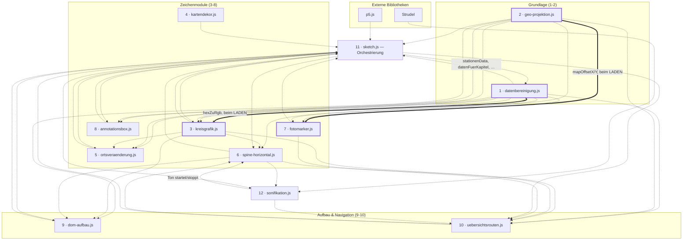
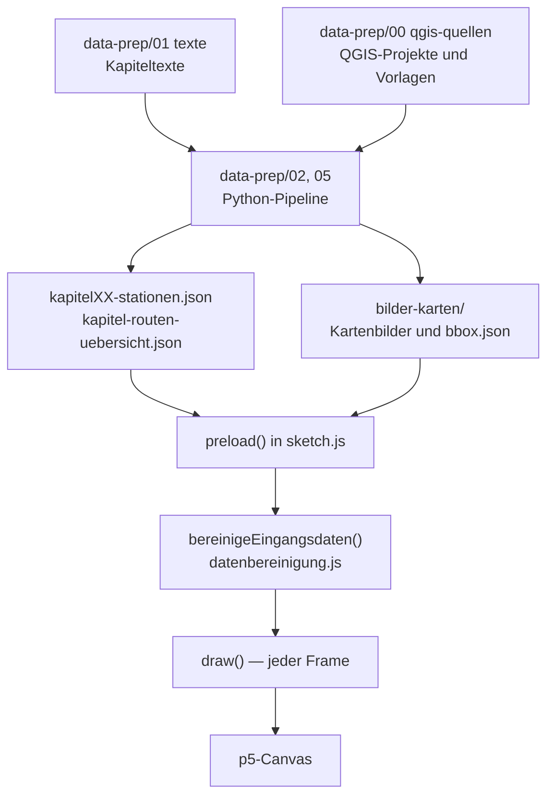

# Architektur

Aufbau der Browser-Anwendung: Ladereihenfolge der Skripte, Aufgabe jedes Moduls
und die Abhängigkeiten zwischen ihnen. Was am aktuellen Stand
verbesserungswürdig ist, steht getrennt davon in
[best-practices-review.md](best-practices-review.md).

**Randbedingung, aus der sich alles Weitere ergibt:** Das Projekt nutzt **keine
ES-Module**. Jede Datei ist ein eigenes `<script>`-Tag, alle Funktionen und
Variablen landen im globalen Scope — **ausser dort, wo eine IIFE sie hält.**
Neun der zwölf Module sind gekapselt und geben nur die genannten Namen über
`window.*` heraus:

| Modul | Exporte |
|---|---|
| `sketch.js` | 35 (13 Wert, 17 Lesebindung, **5 p5-Hooks**) |
| `datenbereinigung.js` | 26 |
| `spine-horizontal.js` | 11 (3 Lesebindungen) |
| `uebersichtsrouten.js` | 10 (3 Lesebindungen) |
| `ortsveraenderung.js` | 8 |
| `kreisgrafik.js` | 5 |
| `sonifikation.js` | 4 (1 Lesebindung) |
| `annotationsbox.js`, `kartendekor.js` | je 2 |

Die drei übrigen — `geo-projektion.js`, `fotomarker.js`, `dom-aufbau.js` —
sind bewusst ungekapselt: Bei ihnen wird **jeder** Top-Level-Name von aussen
gelesen, eine Kapsel brächte null.

**Zwei Regeln, die dabei gelten:**

1. Ist ein exportierter Name **veränderlich** und wird im Modul umgeschaltet,
   steht statt einer Wertzuweisung eine **Lesebindung**
   (`Object.defineProperty` mit `get`). Eine Kopie würde den Startwert
   einfrieren. Bei `sketch.js` betrifft das 17 von 35 Exporten — dort wird
   fast jeder `let` erst in `preload`/`setup`/`draw` gesetzt, also nach dem
   Lauf der IIFE.
2. Die **fünf p5-Hooks** (`preload`, `setup`, `draw`, `mousePressed`,
   `windowResized`) MÜSSEN am `window` liegen — p5 sucht sie dort. Sie stehen
   in der Kapsel und werden wie jeder andere Name exportiert. Fehlte einer,
   bliebe das Bild schwarz, ohne Fehlermeldung.

Bei `datenbereinigung.js` hängt die Ladereihenfolge daran: Es ist Skript 1,
und `kreisgrafik.js` (Skript 3) greift beim Laden auf `hexZuRgb` und
`FWERT_PUNKT_FARBE` zu. Die IIFE läuft sofort und exportiert am Dateiende —
beide Namen liegen also auf `window`, bevor Skript 2 beginnt.

Wo ein exportierter Name **veränderlich** ist und im Modul umgeschaltet wird,
steht statt einer Wertzuweisung eine **Lesebindung** (`Object.defineProperty`
mit `get`) — eine Kopie würde den Startwert einfrieren. Das betrifft
`sonifikationSpieltGerade` sowie `zoomedKapitel`, `kapitelZoomAmount` und
`kapitelHover`. Siehe die Kommentare in den jeweiligen Exportblöcken. Es gibt kein `import`/`export` — wer worauf
zugreift, ist nirgends deklariert, sondern ergibt sich aus der Reihenfolge in
`index.html` und dem Zeitpunkt des Zugriffs.

---

## Ladereihenfolge

`index.html` lädt zuerst zwei externe Bibliotheken, dann zwölf eigene Dateien:

| # | Datei | Rolle |
|---|---|---|
| — | p5.js 1.9.0 (CDN) | Canvas, Zeichen-API, Lebenszyklus (`preload`/`setup`/`draw`) |
| — | Strudel 1.0.3 (CDN) | Klangsynthese für die Sonifikation |
| 1 | `datenbereinigung.js` | Datenfunktionen und Konstanten, keine Zeichenaufrufe |
| 2 | `geo-projektion.js` | Geografie: Bboxen und Projektion lon/lat → Bildschirm |
| 3 | `kreisgrafik.js` | Kreisdiagramme der Orte |
| 4 | `kartendekor.js` | Windrose und Massstabsleiste |
| 5 | `ortsveraenderung.js` | Schlussakt „Ortsveränderung" |
| 6 | `spine-horizontal.js` | Graph-Ansicht: waagrechte Zeitleiste + Play |
| 7 | `fotomarker.js` | Foto-Marker und Bild-Popup |
| 8 | `annotationsbox.js` | Positionswahl der Annotationsbox |
| 9 | `dom-aufbau.js` | Kapitelregister, Legende, Marker-Ebenen |
| 10 | `uebersichtsrouten.js` | Übersichtsakt und Kapitel-Navigation |
| 11 | `sketch.js` | Orchestrierung: `preload`/`setup`/`draw`/`mousePressed` |
| 12 | `sonifikation.js` | Tonspur, synchron zur Graph-Animation |

---

## Abhängigkeitsdiagramm

Durchgezogene Pfeile sind **Ladezeit**-Abhängigkeiten: Sie erzwingen die
Reihenfolge, ein Vertauschen bricht den Start sofort. Gepunktete Pfeile sind
**Laufzeit**-Zugriffe — sie funktionieren unabhängig von der Reihenfolge, weil
sie erst beim Aufruf ausgewertet werden.

**Die beiden Ladezeit-Abhängigkeiten** — empirisch ermittelt, indem jedes Modul
einzeln geladen wurde:

| Modul | braucht beim Laden | aus | Grund |
|---|---|---|---|
| `kreisgrafik.js` | `hexZuRgb` | `datenbereinigung.js` | `const FWERT_PUNKT_FARBE_RGB = hexZuRgb(FWERT_PUNKT_FARBE)` |
| `fotomarker.js` | `mapOffsetX`, `mapOffsetY` | `geo-projektion.js` | `let letzterFotoOffsetX = mapOffsetX, letzterFotoOffsetY = mapOffsetY` |

Alle **zehn übrigen Module laden eigenständig**. Ihre Zugriffe nach aussen
finden ausschliesslich zur Laufzeit statt.

**Zyklen sind vorhanden und tragbar.** `sketch.js` nutzt fast jedes Modul, und
fast jedes Modul greift auf `sketch.js`-Globals wie `stationenData` zu;
ebenso `spine-horizontal.js` ↔ `sonifikation.js` und
`spine-horizontal.js` ↔ `uebersichtsrouten.js`. Das trägt nur, weil **alle**
Zugriffe in beiden Richtungen zur Laufzeit erfolgen. Ein neuer
Top-Level-Initialisierer, der eine fremde Variable liest, kann diese Balance
kippen — deshalb weisen `kreisgrafik.js` und `fotomarker.js` ihre in einem
eigenen Header-Abschnitt aus.

---

## Module im Einzelnen

| # | Modul | Zeilen | Hauptfunktionen | Wichtigste eigene Variablen |
|---|---|---|---|---|
| 1 | `datenbereinigung.js` | 572 | `bereinigeStationenDaten`, `baueSpineDaten`, `sammleAnnotationenNachOrtBasis`, `zaehleBandCounts`, `zaehleAnnotationenLiveNachOrtBasis`, `ortRunsFuerSpine`, `ortRunSichtbar`, `kreisRadius`, `groessterKreisRadius`, `hexZuRgb` | `KREIS_KATEGORIEN`, `SCROLL_MEILENSTEINE`, `ROUTE_COLOR_RGB`, alle `FWERT_*`, `KAPITEL_MIT_SPINE_PANEL`, `WOHNUNG_SAMMELPUNKT_ANKER` — **gekapselt**, 26 Exporte. Intern: alle drei `GEDANKEN_*`, die übrigen drei `WOHNUNG_*` und `valenzBucket` |
| 2 | `geo-projektion.js` | 148 | `lonLatToScreen`, `coverCrop`, `cropToBbox`, `bboxToImgCrop` | `startBbox`, `uebersichtBbox`, `ch1ImgBbox`, `mapOffsetX`, `mapOffsetY` |
| 3 | `kreisgrafik.js` | 497 | `zeichneKreiseOrtRuns`, `zeichneKreiseFuerRun`, `zeichneFwertPunkte`, `leereBandCounts` | `FWERT_PUNKT_DURCHMESSER` — **gekapselt**, die übrigen acht Namen (u. a. `HATCH_SPACING`, `FWERT_PUNKT_FARBE_RGB`, `zeichneKreisLabels`) sind modulintern |
| 4 | `kartendekor.js` | 219 | `zeichneMassstabsleiste`, `zeichneWindrose` | — **gekapselt**, intern: `haversineMeter`, `MASSSTAB_SCHRITTE` |
| 5 | `ortsveraenderung.js` | 687 | `zeichneOrtsveraenderung`, `ovPhase`, `ovZoomBbox` | `OV_KARTE_AUS`/`OV_ZOOM`/`SK_*`-Phasenfenster — **als einziges Modul gekapselt**, alles Übrige ist modulintern |
| 6 | `spine-horizontal.js` | 548 | `zeichneSpineHorizontal`, `toggleGrafikPlay`, `setzeKapitelAnsichtModus`, `setzeGrafikZurueck`, `stelleSpineDatenBereit`, `spineEintraegeFuer`, `aktuelleGrafikAnimationDauer`, `aktualisiereGrafikFortschritt` | `grafikSpielt`, `grafikFortschritt`, `grafikPlayAusblendStart` (Lesebindungen) — **gekapselt**, intern: beide Spine-Caches, alle `SPINE_*`, `spineLayout` |
| 7 | `fotomarker.js` | 133 | `zeichneFotoMarker`, `merkeKartenlage`, `oeffneFotoPopup`, `schliesseFotoPopup` | `fotoMarkerListe`, `letzteActiveBbox`, `letzterFotoOffsetX/Y`, `FOTO_MARKER_TREFFER_RADIUS` |
| 8 | `annotationsbox.js` | 152 | `annotationBoxPosition` | `ANNOTATION_BOX_POSITIONEN` — **gekapselt**, intern u. a. `annotationBoxPositionCache` |
| 9 | `dom-aufbau.js` | 299 | `baueKapitelRegister`, `baueLegende`, `baueKartenMarkierungen`, `oeffneRegister` | — (baut nur DOM, hält keinen Zustand) |
| 10 | `uebersichtsrouten.js` | 652 | `zeichneUebersichtsrouten`, `kapitelScheiben`, `aktualisiereKapitelZoom`, `springeZuKapitelZoom`, `scrolleZuKapitel1` | `zoomedKapitel`, `kapitelZoomAmount`, `kapitelHover` (alle drei als Lesebindung) — **gekapselt**, intern u. a. `kapitelHitze`, `oeffneKapitelZoom`, `scheibenCache` |
| 11 | `sketch.js` | 994 | `preload`, `setup`, `draw`, `mousePressed`, `windowResized`, `zeichneRoute`, `datenFuerKapitel`, `kapitelHatEigeneAnsicht`, `setzeAnsichtsModus`, `starteKapitelEinstieg` | `stationenData`, `uebersichtsRouten`, `kapitelAnsichtsModus`, 13 DOM-Handles (alle als Lesebindung) — **gekapselt**, intern u. a. `kapitelKarten`, `bgImage`/`bgImage2`/`ch1Image`, 12 weitere DOM-Handles |
| 12 | `sonifikation.js` | 370 | `spieleSonifikationFuer`, `beendeSonifikationAudio` | `SONIFIKATION_GESAMTDAUER_SEK`, `sonifikationSpieltGerade` (als Lesebindung) — **gekapselt**, die übrigen 17 Namen (u. a. `baueSpielplan`, `baueGainFolge`, `sonifikationDaten`) sind modulintern |

`dom-aufbau.js` ist das einzige Modul ohne eigene Top-Level-Variablen: es baut
DOM-Knoten und schreibt sie in Handles, die `sketch.js` hält.

Von `sketch.js`' 56 Top-Level-Variablen werden **24 in `setup()` über
`document.getElementById()` befüllt** — fünf davon (`fotoPopup` und die vier
`fotoPopup*`-Unterelemente) sind in `fotomarker.js` deklariert und werden hier
nur gefüllt.

---

## Was `preload()` lädt

`preload()` in `sketch.js` lädt alles, bevor der erste Frame gezeichnet wird —
**20 Bilder und 37 JSON-Dateien**.

**Bilder** (alle in `bilder-karten/`):

| Datei | Variable | Verwendung |
|---|---|---|
| `paris-startkarte-web.png` | `bgImage` | Startseite und Schlusskarte |
| `paris-ueberblickkarte-web.png` | `bgImage2` | Übersichtsakt mit allen 18 Routen |
| `kapitel01-qgis-karte-web.png` | `ch1Image` | Kapitel-1-Kartenausschnitt |
| `kapitelXX-karte.png` (17×, Kapitel 02–18) | `kapitelKarten[nr].bild` | Kartenausschnitt je Kapitel |

**Daten:**

| Datei | Variable | Inhalt |
|---|---|---|
| `kapitelXX-stationen.json` (18×, Kapitel 01–18) | `stationenData` (01), `kapitel03Data` (03), `weitereKapitelDaten[nr]` | Annotationen, Route, ortRuns je Kapitel |
| `kapitel-routen-uebersicht.json` | `uebersichtsRouten` | Strassenrouten aller Kapitel für den Übersichtsakt |
| `fotomarker.json` | `fotoMarkerListe` | Koordinaten und Metadaten der Fotobank-Marker |
| `bilder-karten/kapitelXX-bbox.json` (17×) | `kapitelKarten[nr].bboxRaw` | Georeferenz des jeweiligen Kartenausschnitts |

Kapitel 1 hat **kein** `bbox.json`: seine Georeferenz steht als Literal
`ch1ImgBbox` in `geo-projektion.js`. Die Kapitelkarten 02–18 samt ihren
bbox-Dateien erzeugt die Python-Pipeline
(`data-prep/05 bereinigen/schneide-kapitelkarten.py`).

---

## Datenfluss von der Quelle zum Bild

---

## Wie diese Übersicht entstanden ist

Die Angaben sind aus dem Code erhoben, nicht aus den Kommentaren übernommen:

- **Ladereihenfolge:** direkt aus den `<script src="…">`-Tags in `index.html`.
- **Funktionen und Variablen:** Top-Level-Deklarationen je Datei, auf
  kommentarbereinigtem Quelltext gezählt (inklusive `async function`).
- **Ladezeit-Abhängigkeiten:** jedes Modul einzeln in JavaScriptCore geladen —
  wer dabei einen `ReferenceError` wirft, braucht ein früher geladenes Modul.
  Genau zwei tun das.
- **Laufzeit-Abhängigkeiten:** für jedes Modul geprüft, welche Namen es
  verwendet, die ein anderes Modul deklariert.
