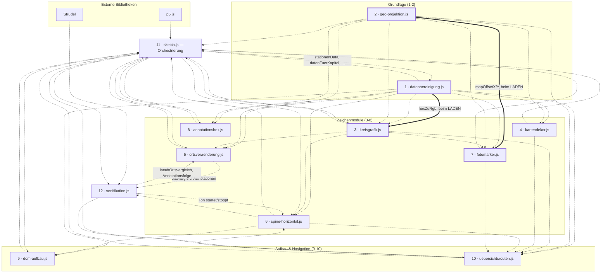
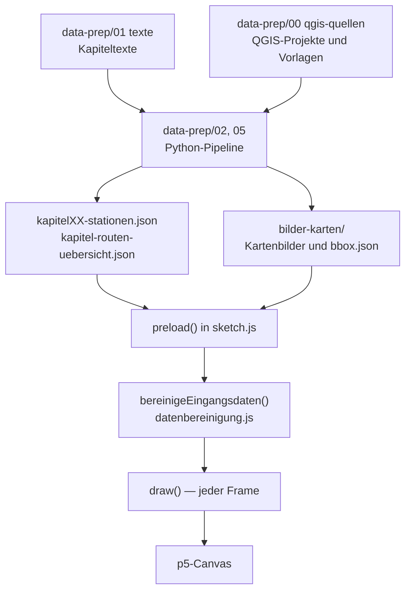

# Architektur

Aufbau der Browser-Anwendung: Ladereihenfolge der Skripte, Aufgabe jedes Moduls
und die Abhängigkeiten zwischen ihnen. Was am aktuellen Stand
verbesserungswürdig ist, steht getrennt davon in
[best-practices-review.md](best-practices-review.md).

**Randbedingung, aus der sich alles Weitere ergibt:** Das Projekt nutzt **keine
ES-Module**. Jede Datei ist ein eigenes `<script>`-Tag, alle Funktionen und
Variablen landen im globalen Scope — **ausser dort, wo eine IIFE sie hält.**
Neun der zwölf Module sind gekapselt und geben nur die genannten Namen über
`window.*` heraus:

| Modul | Exporte |
|---|---|
| `datenbereinigung.js` | 38 |
| `sketch.js` | 29 (11 Wert, 13 Lesebindung, **5 p5-Hooks**) |
| `kreisgrafik.js` | 12 |
| `spine-horizontal.js` | 11 (3 Lesebindungen) |
| `uebersichtsrouten.js` | 12 (3 Lesebindungen) |
| `ortsveraenderung.js` | 3 |
| `sonifikation.js` | 6 (1 Lesebindung) |
| `kartendekor.js` | 3 |
| `annotationsbox.js` | 2 |

Die drei übrigen sind bewusst ungekapselt: Bei ihnen wird **jeder**
Top-Level-Name von aussen gelesen, eine Kapsel müsste also alles exportieren
und nähme dem globalen Scope nichts ab.

| Modul | Top-Level-Namen | davon nur intern | Warum ungekapselt |
|---|---|---|---|
| `geo-projektion.js` | 11 | **0** | Unterste Schicht — `lonLatToScreen`, die drei Bboxen plus `UEBERSICHT_SCHNITT_BBOX`, `mapOffsetX/Y` und die vier Crop-/Bbox-Funktionen werden alle von aussen gebraucht |
| `dom-aufbau.js` | 4 | **0** | Nur die vier `baue*`-Funktionen, alle von `setup()` gerufen |
| `fotomarker.js` | 13 | **0** | Zusätzlicher Blocker: `sketch.js` **schreibt** in sechs dieser Namen (`fotoMarkerListe` in `preload`/`bereinigeEingangsdaten`, die fünf `fotoPopup*`-Handles in `setup`). Eine Kapsel würde diese sieben Zuweisungen wirkungslos machen — sie liefen ins Leere, ohne Fehlermeldung |

Für `fotomarker.js` wäre eine Kapselung also nicht nur nutzlos, sondern
schädlich, solange die Initialisierung in `sketch.js` liegt. Das ist der Rest
der Fremdschreibzugriffe aus Punkt 8 (21 → 7).

**Form der Kapsel** — gilt für alle neun, steht deshalb nur hier und nicht in
jeder Datei:

- **Rumpf nicht eingerückt.** Eine Einrückung um zwei Zeichen würde bei
  Dateien dieser Grösse jede Zeile als geändert markieren: Diff unlesbar,
  `git blame` wertlos. So bleibt der Kapsel-Diff eine reine Einfügung von
  Wrapper und Exportblock.
- **Kein `'use strict'`.** Wäre eine Verhaltensänderung über die Kapselung
  hinaus (undeklarierte Zuweisungen, `this`, doppelte Parameternamen) und
  gehört, wenn überhaupt, in einen eigenen Schritt.
- **Exportblock am Dateiende**, `window.X = X` je Zeile, kein
  Namespace-Objekt — so bleiben die Aufrufstellen in den lesenden Modulen
  unverändert.

**Zwei Regeln, die dabei gelten:**

1. Ist ein exportierter Name **veränderlich** und wird im Modul umgeschaltet,
   steht statt einer Wertzuweisung eine **Lesebindung**
   (`Object.defineProperty` mit `get`). Eine Kopie würde den Startwert
   einfrieren. Bei `sketch.js` betrifft das 17 von 35 Exporten — dort wird
   fast jeder `let` erst in `preload`/`setup`/`draw` gesetzt, also nach dem
   Lauf der IIFE.
2. Die **fünf p5-Hooks** (`preload`, `setup`, `draw`, `mousePressed`,
   `windowResized`) MÜSSEN am `window` liegen — p5 sucht sie dort. Sie stehen
   in der Kapsel und werden wie jeder andere Name exportiert. Fehlte einer,
   bliebe das Bild schwarz, ohne Fehlermeldung.

Bei `datenbereinigung.js` hängt die Ladereihenfolge daran: Es ist Skript 1,
und `kreisgrafik.js` (Skript 3) greift beim Laden auf `hexZuRgb` und
`FWERT_PUNKT_FARBE` zu. Die IIFE läuft sofort und exportiert am Dateiende —
beide Namen liegen also auf `window`, bevor Skript 2 beginnt.

Wo ein exportierter Name **veränderlich** ist und im Modul umgeschaltet wird,
steht statt einer Wertzuweisung eine **Lesebindung** (`Object.defineProperty`
mit `get`) — eine Kopie würde den Startwert einfrieren. Das betrifft
`sonifikationSpieltGerade` sowie `zoomedKapitel`, `kapitelZoomAmount` und
`kapitelHover`. Siehe die Kommentare in den jeweiligen Exportblöcken. Es gibt kein `import`/`export` — wer worauf
zugreift, ist nirgends deklariert, sondern ergibt sich aus der Reihenfolge in
`index.html` und dem Zeitpunkt des Zugriffs.

---

## Kommentar-Konventionen

Gilt für alle zwölf Module. Aufgestellt beim Kommentar-Durchgang im August
2026, der die Kommentarzeilen projektweit von 2260 auf 752 gebracht hat.

**Länge**

- **Jeder Kommentar höchstens 1–2 Zeilen.** Braucht eine Erklärung mehr,
  gehört sie nicht in den Code, sondern nach `docs/` — oder gar nicht
  geschrieben.
- **Ausnahme: Warnung vor einem echten Stolperstein.** Ein Fehler, der sonst
  wiederkehrt, darf 3–4 Zeilen bekommen. Solche Blöcke beginnen mit
  `ACHTUNG` und stehen als eigener Block, nicht mit beschreibendem Text
  verklebt — sonst ist die Warnung im Fliesstext nicht mehr erkennbar.
- **Kopfblock am Dateianfang: 4–5 Zeilen.** Was die Datei macht, grob wie.
  Keine Abhängigkeitslisten — die stehen im Diagramm oben in dieser Datei.

**Inhalt**

- **Nur der Ist-Zustand.** Keine Historie („früher…", „vorher stand hier…"),
  keine Bug-Geschichten, keine verworfenen Alternativen. Was einmal war,
  steht in `docs/cleanup-log.md` und in der Git-Historie.
- **Selbsterklärender Code bekommt keinen Kommentar.** Das Was steht im
  Code; ein Kommentar begründet das Warum oder er entfällt.
- **Offene Stellen ehrlich benennen** statt zu beschönigen — „Ursache
  ungeklärt, nur umgangen" ist eine zulässige und erwünschte Aussage.
- **Konkret statt abstrakt.** Zeilennummern, Funktionsnamen, echte Werte,
  wo sie tragen.

**Prüfbarkeit**

Beim Kürzen zeigte sich wiederholt: Kommentare veralten schneller als Code.
Zwei Dinge deshalb bei jeder Änderung mitprüfen —

- **Dateiangaben.** Verweise wie „`zeichneKreiseFuerRun` in `sketch.js`" waren
  an mehreren Stellen falsch, weil die Funktion längst in einem anderen Modul
  lag. Ein Verweis nennt die Datei nur, wenn sie stimmt.
- **Namen, die es nicht mehr gibt.** Der Durchgang fand rund fünfzehn tote
  Namen in Kommentaren (`aktualisiereGrafik`, `zeichneVergleichsKnoten`,
  `sonifikationSpieltAb`, `baue_kapitel03.py` …). Vor dem Umbenennen oder
  Entfernen eines Namens auch die Kommentare mitsuchen, nicht nur den Code.

---

## Ladereihenfolge

`index.html` lädt zuerst zwei externe Bibliotheken, dann zwölf eigene Dateien:

| # | Datei | Rolle |
|---|---|---|
| — | p5.js 1.9.0 (CDN) | Canvas, Zeichen-API, Lebenszyklus (`preload`/`setup`/`draw`) |
| — | Strudel 1.0.3 (CDN) | Klangsynthese für die Sonifikation |
| 1 | `datenbereinigung.js` | Datenfunktionen und Konstanten, keine Zeichenaufrufe |
| 2 | `geo-projektion.js` | Geografie: Bboxen und Projektion lon/lat → Bildschirm |
| 3 | `kreisgrafik.js` | Kreisdiagramme der Orte |
| 4 | `kartendekor.js` | Routenzug, Massstabsleiste (und die stillgelegte Windrose) |
| 5 | `ortsveraenderung.js` | Ansicht „Ortsvergleich" |
| 6 | `spine-horizontal.js` | Graph-Ansicht: waagrechte Zeitleiste + Play |
| 7 | `fotomarker.js` | Foto-Marker und Bild-Popup |
| 8 | `annotationsbox.js` | Positionswahl der Annotationsbox |
| 9 | `dom-aufbau.js` | Kapitelregister und Marker-Ebenen |
| 10 | `uebersichtsrouten.js` | Übersichtsakt und Kapitel-Navigation |
| 11 | `sketch.js` | Orchestrierung: `preload`/`setup`/`draw`/`mousePressed` |
| 12 | `sonifikation.js` | Tonspur, synchron zur Graph-Animation |

---

## Abhängigkeitsdiagramm

Durchgezogene Pfeile sind **Ladezeit**-Abhängigkeiten: Sie erzwingen die
Reihenfolge, ein Vertauschen bricht den Start sofort. Gepunktete Pfeile sind
**Laufzeit**-Zugriffe — sie funktionieren unabhängig von der Reihenfolge, weil
sie erst beim Aufruf ausgewertet werden.

**Die beiden Ladezeit-Abhängigkeiten** — empirisch ermittelt, indem jedes Modul
einzeln geladen wurde:

| Modul | braucht beim Laden | aus | Grund |
|---|---|---|---|
| `kreisgrafik.js` | `hexZuRgb` | `datenbereinigung.js` | `const FWERT_PUNKT_FARBE_RGB = hexZuRgb(FWERT_PUNKT_FARBE)` |
| `fotomarker.js` | `mapOffsetX`, `mapOffsetY` | `geo-projektion.js` | `let letzterFotoOffsetX = mapOffsetX, letzterFotoOffsetY = mapOffsetY` |

Alle **zehn übrigen Module laden eigenständig**. Ihre Zugriffe nach aussen
finden ausschliesslich zur Laufzeit statt.

**Zyklen sind vorhanden und tragbar.** `sketch.js` nutzt fast jedes Modul, und
fast jedes Modul greift auf `sketch.js`-Globals wie `stationenData` zu;
ebenso `spine-horizontal.js` ↔ `sonifikation.js` und
`spine-horizontal.js` ↔ `uebersichtsrouten.js`. Das trägt nur, weil **alle**
Zugriffe in beiden Richtungen zur Laufzeit erfolgen. Ein neuer
Top-Level-Initialisierer, der eine fremde Variable liest, kann diese Balance
kippen — deshalb weisen `kreisgrafik.js` und `fotomarker.js` ihre in einem
eigenen Header-Abschnitt aus.

---

## Module im Einzelnen

| # | Modul | Zeilen | Hauptfunktionen | Wichtigste eigene Variablen |
|---|---|---|---|---|
| 1 | `datenbereinigung.js` | 472 | `bereinigeStationenDaten`, `baueSpineDaten`, `sammleAnnotationenNachOrtBasis`, `zaehleBandCounts`, `zaehleAnnotationenLiveNachOrtBasis`, `ortRunsFuerSpine`, `ortRunSichtbar`, `kreisRadius`, `groessterKreisRadius`, `hexZuRgb` | `KREIS_KATEGORIEN`, `SCROLL_MEILENSTEINE`, `ROUTE_COLOR_RGB`, `FWERT_COLOR`/`FWERT_COLOR_RGB`, `FWERT_PUNKTGROESSE`, `FWERT_PUNKT_DURCHMESSER`, beide `FOTO_MARKER_*_RGB`, `KAPITEL_MIT_SPINE_PANEL`, `WOHNUNG_SAMMELPUNKT_ANKER`, `SCHRIFT_SANS`/`SCHRIFT_SERIF`, `hexZuRgb`/`rgbZuHex`, die Legendenbegriffe aus dem PDF (`WAHRNEHMUNG_LABELS`, `LEGENDE_BLOCK_TITEL`, `LEGENDE_KREISGROESSE`, `LEGENDE_VALENZ`, `LEGENDE_ORTSBESCHRIFTUNG`, `LEGENDE_TITEL`/`LEGENDE_UNTERTITEL`) — **gekapselt**, 39 Exporte. Intern: alle drei `GEDANKEN_*`, die übrigen drei `WOHNUNG_*`, die beiden Fotomarker-Hexwerte und `valenzBucket` |
| 2 | `geo-projektion.js` | 96 | `lonLatToScreen`, `coverCrop`, `cropToBbox`, `bboxToImgCrop`, `passeBboxInRahmen` | `startBbox`, `uebersichtBbox`, `ch1ImgBbox`, `UEBERSICHT_SCHNITT_BBOX`, `mapOffsetX`, `mapOffsetY` |
| 3 | `kreisgrafik.js` | 1164 | `zeichneKreiseOrtRuns`, `zeichneKreiseFuerRun`, `zeichneFwertPunkte`, `zeichneKreisLabels`, `zeichneDemoKreisgrafik`, `zeichneSchleier`, `kategorieZeileGetroffen`, `zeichneRegisterleiste`, `zeichneInfoLeiste`, `reiterGetroffen`, `legendenLeisteHoehe`, `leereBandCounts` | **gekapselt**, 12 Exporte; die übrigen Namen (u. a. `HATCH_SPACING`, `schraffiere`, alle `DEMO_*`, `LEGENDE_*` und `LEISTE_*`) sind modulintern. Beherbergt seit dem Onboarding-Umbau auch den neunstufigen Legendenaufbau (`demoLegende` und seine Zeichenroutinen) und beide Register am unteren Rand |
| 4 | `kartendekor.js` | 312 | `zeichneRoute`, `zeichneMassstabsleiste`, `zeichneWindrose` | — **gekapselt**, 3 Exporte; intern `haversineMeter`, `MASSSTAB_SCHRITTE`, der Routenpuffer und seine Helfer (`routenPufferBereit`, `routenStufenZuege`, `routenStufenAlpha`, alle `ROUTE_*`). `zeichneWindrose` hat derzeit keinen Aufrufer: der Aufruf in `draw()` ist auskommentiert |
| 5 | `ortsveraenderung.js` | 489 | `zeichneOrtsveraenderung` | **Zwei Exporte**: die Zeichenfunktion und `OV_KAPITEL_ZAHL`, aus der `spine-horizontal.js` die Abspieldauer rechnet. Die Ansicht bringt Reihenfolge, Linienlayout und gemeinsame Kreis-Skala (`ovBerechneLayout`) selbst mit, `draw()` übergibt nur `grafikFortschritt`. Alles Übrige ist modulintern |
| 6 | `spine-horizontal.js` | 363 | `zeichneSpineHorizontal`, `toggleGrafikPlay`, `setzeKapitelAnsichtModus`, `setzeGrafikZurueck`, `stelleSpineDatenBereit`, `spineEintraegeFuer`, `aktuelleGrafikAnimationDauer`, `aktualisiereGrafikFortschritt` | `grafikSpielt`, `grafikFortschritt`, `grafikPlayAusblendStart` (Lesebindungen) — **gekapselt**, intern: beide Spine-Caches, alle `SPINE_*`, `spineLayout` |
| 7 | `fotomarker.js` | 116 | `zeichneFotoMarker`, `merkeKartenlage`, `oeffneFotoPopup`, `schliesseFotoPopup` | `fotoMarkerListe`, `letzteActiveBbox`, `letzterFotoOffsetX/Y`, `FOTO_MARKER_TREFFER_RADIUS`. Zeichnet einen Punkt mit hellem Kern; Grösse abgeleitet aus `FWERT_PUNKT_DURCHMESSER`, Beschriftung über `zeichneKreisLabels` |
| 8 | `annotationsbox.js` | 106 | `annotationBoxPosition` | `ANNOTATION_BOX_POSITIONEN` — **gekapselt**, intern u. a. `annotationBoxPositionCache` |
| 9 | `dom-aufbau.js` | 107 | `baueKapitelRegister`, `baueKartenMarkierungen`, `baueStationsMarker`, `baueZwischenMarker` | — (baut nur DOM, hält keinen Zustand) |
| 10 | `uebersichtsrouten.js` | 411 | `zeichneUebersichtsrouten`, `kapitelScheiben`, `aktualisiereKapitelZoom`, `springeZuKapitelZoom`, `scrolleZuKapitel1`, `waehleAnsichtsModus` | `zoomedKapitel`, `kapitelZoomAmount`, `kapitelHover` (alle drei als Lesebindung) — **gekapselt**, intern u. a. `kapitelHitze`, `oeffneKapitelZoom`, `scheibenCache` |
| 11 | `sketch.js` | 892 | `preload`, `setup`, `draw`, `mousePressed`, `windowResized`, `datenFuerKapitel`, `kapitelHatEigeneAnsicht`, `setzeAnsichtsModus`, `starteKapitelEinstieg` | `stationenData`, `uebersichtsRouten`, `kapitelAnsichtsModus`, `kapitel1Geklemmt`/`kapitel1ZoomAmount`, 9 DOM-Handles (als Lesebindung) — **gekapselt**, intern u. a. `kapitelKarten`, `bgImage`/`bgImage2`/`ch1Image`, der Zustand beider Register (`legendenLeisteOffen`, `legendeAus`, `infoAus`) |
| 12 | `sonifikation.js` | 737 | `spieleSonifikationFuer`, `beendeSonifikationAudio` | `SONIFIKATION_GESAMTDAUER_SEK`, `sonifikationSpieltGerade` (als Lesebindung) — **gekapselt**, die übrigen 17 Namen (u. a. `baueSpielplan`, `baueGainFolge`, `sonifikationDaten`) sind modulintern |

`dom-aufbau.js` ist das einzige Modul ohne eigene Top-Level-Variablen: es baut
DOM-Knoten und schreibt sie in Handles, die `sketch.js` hält.

Von `sketch.js`' 57 Top-Level-Variablen werden **25 in `setup()` über
`document.getElementById()` befüllt** — fünf davon (`fotoPopup` und die vier
`fotoPopup*`-Unterelemente) sind in `fotomarker.js` deklariert und werden hier
nur gefüllt.

**Scrollgebundene Canvas-Beschriftungen hängen an einem Begleittext.** Ein
`
` in `index.html` trägt das Scroll-Fenster, ein
`data-*`-Attribut macht daraus zusätzlich eine Zeichenanweisung: die drei
`data-demo-gruppe`-Texte steuern die Beschriftungen am Demo-Kreis, der
`data-foto-hinweis`-Text steuert den Bedienhinweis am Fotomarker und nennt
zugleich dessen Titel. So gibt es je Fenster nur eine Zahl, nicht zwei.

**Die Route wird in einen eigenen Puffer gezeichnet, nicht direkt aufs
Canvas** (`zeichneRoute` in `kartendekor.js`). Grund ist der Verlauf: halbdurchsichtige Striche addieren nach
Porter-Duff ihre Deckkraft, wo sie einander berühren — an Stufengrenzen, an
den Kappen und überall, wo die Route sich selbst kreuzt. Im Puffer
(`routenPufferBereit`) wird stattdessen jede Stufe **deckend** gezogen und
überschreibt die vorherige; den Verlauf macht ein Waschgang vor jeder Stufe
(`erase`, also `destination-out`), der allem bisher Gezeichneten anteilig
Deckkraft nimmt. Die Waschstärken leiten sich aus `routenStufenAlpha()` ab und
bilden dieselbe lineare Rampe wie zuvor exakt nach.

Die Stufen schneidet `routenStufenZuege()` nach **Bogenlänge in
Bildschirmpixeln** (`ROUTE_SCHWEIF_PX`), nicht nach Wegpunkt-Indizes: an die
Punktdichte gebunden schwankte die Schweiflänge zwischen den Kapiteln um
Faktor 13. Grenzen werden ins Segment interpoliert, damit benachbarte Züge
exakt aneinander anschliessen. Der Puffer trägt keinen `alphaMultiplier` — der
kommt erst beim Auflegen als `tint()`, damit er die Einblendung eines Kapitels
ohne Neuaufbau übersteht.

**Kapitel 1 endet an einer Klemme.** `uebersichtRoutenStart` ist zugleich das
Ende von Kapitel 1: `draw()` hält die Scrollposition dort fest
(`klemmeScroll`), einen Rauszoom-Akt gibt es nicht mehr. In den Übersichtsakt
führt nur ein Klick — `springeZurUebersicht()` und `springeZuKapitelZoom()`
rufen dafür `loeseKapitel1Klemme()`, sonst zöge der nächste Frame sofort
zurück. Ein Zurückscrollen unter die Marke setzt die Klemme neu. An demselben
Merker hängt `zoomOutAmount`: solange die Klemme steht, liegt die Karte in
Kapitel 1, danach auf der Überblickskarte — ein Schnitt, keine Rampe, weil der
Sprung selbst ein Schnitt ist.

**Eine zweite Klemme trennt Überblickskarte und Ortsvergleich.** Sie liegt auf
`uebersichtRoutenEnd`, dem Ende der Scrollstrecke — dahinter stehen nur noch
200 vh Auslauf, damit die Marke überhaupt erreichbar bleibt. Der Ortsvergleich
hat **keine eigene Strecke**: er sitzt auf der Klemme und läuft über den
Play-Knopf. Welche der beiden Ansichten gilt, entscheidet deshalb nicht die
Scrollposition, sondern `kapitelAnsichtsModus`; `draw()` klemmt in der
Kartenansicht nach unten, im Ortsvergleich nach oben. Hinüber führt nur
„Plan"/„Graph" im Register. Einen Schlussakt gibt es ebenfalls nicht mehr: die
Startkarte kehrt nicht zurück.

**Der Ton läuft im selben Elementmodell.** `sonifikation.js` spielt einen Klang
je Annotation, getaktet auf den Moment, in dem sie im Bild erscheint. Für die
Kapitel liefert die Spine diese Momente, für den Ortsvergleich
`ortsvergleichAnnotationen()` in `ortsveraenderung.js` — dieselbe Zeitrechnung
wie sein Bild, deshalb steht sie dort und nicht im Tonmodul. Das Zählen der
laufenden Kreisstände teilen sich beide über `baueElementeAus()`. Die
Spieldauer folgt wie überall der Zahl der Elemente: 1417 Annotationen auf den
sieben Orten ergeben 138 s gegenüber 45 s in Kapitel 1. Weil
`aktuelleGrafikAnimationDauer()` diese Dauer übernimmt, bleiben Bild und Ton
synchron.

**Die Zeitachse hängt an den Elementen, nicht an den Kapiteln.** Gleich lange
Kapitel hiessen: 44 % der Laufzeit in Lücken, in denen keiner der sieben Orte
etwas beiträgt, und kurze Besuche, die aufblitzen statt zu wachsen — Madeleines
Besuch in Kapitel 1 dauerte so 0.84 s statt 1.66 s. `ovBaueDaten()` legt deshalb
alle Elemente in Erzählreihenfolge ab; `ovStandFuer()` interpoliert daraus den
Kapitelstand, und `ortsvergleichAnnotationen()` gibt denselben Rang als
Fortschritt an den Ton. Reihenfolge und Zuordnung bleiben unberührt, nur die
Leerläufe schrumpfen. Wo ein Kapitel dennoch später einsetzt — Kapitel 2 tut das
— stellt `spieleElementAudio()` dem Muster eine Pause voran, sonst klänge der
erste Ton, bevor sein Kreis da ist.

**Ein Playhead für beide Graph-Ansichten.** `grafikFortschritt` aus
`spine-horizontal.js` treibt die Kapitel-Spine wie den Ortsvergleich; `draw()`
tickt ihn einmal je Frame für beide. Die Spine liest ihn als Position auf ihrer
Achse, der Ortsvergleich als Kapitelzähler 1..18. Was gerade läuft, beantwortet
`laeuftOrtsvergleich()` in `uebersichtsrouten.js` — einzige Quelle dieser
Regel, gelesen von der zweiten Klemme, von `draw()`, von der Abspieldauer und
vom Ton, den der Ortsvergleich als einziger nicht hat.

**„Plan"/„Graph" schaltet je nach Ort etwas anderes um**, und die
Fallunterscheidung steht an genau einer Stelle: `waehleAnsichtsModus()` in
`uebersichtsrouten.js`, dem einzigen Einstieg beider Knöpfe. Im Kapitel — auch
in Kapitel 1, erkennbar an der stehenden Klemme — reicht sie an
`setzeKapitelAnsichtModus()` durch und schaltet zwischen Kartenausschnitt und
Spine. In der Übersicht springt sie stattdessen zwischen den beiden Strecken,
weil dort mit dem Modus auch die Scrollposition wechseln muss. In `draw()`
teilen sich beide Graph-Ansichten die Übermalung des Frames: die Spine für ein
Kapitel, `zeichneOrtsveraenderung()` für die Übersicht.

**Der Ortsvergleich ordnet die sieben Orte auf einer Linie an**, in der
Reihenfolge ihres ersten Auftretens im Buch — nicht mehr geografisch. Weil
diese Reihenfolge nach Kapiteln aufsteigt, kommen die Orte beim Abspielen von
links nach rechts dazu, wie die Einträge der Spine unter ihrem Playhead. Über
dem Kreis stehen Erläuterung und Datenzeile, darunter Ortsname und die Nummer
des Kapitels, in dem der Ort zuletzt vorkam (`ovStand().letztes`). Statt des
100-px-Deckels rechnet `ovBerechneLayout()` eine **gemeinsame `kreisSkala`**:
alle sieben Bänder liegen zwischen 45 und 137 Annotationen und sässen sonst
samt und sonders am Anschlag. Die Skala nimmt den schärferen von zwei Werten —
waagrecht dürfen sich Nachbarn nicht berühren, senkrecht muss der grösste Kreis
zwischen Textblock und Beschriftung passen.

Vor der Klemme liegen zwei Strecken: 140 vh Projekttext-Einblender ab
`routeEnd`, dann ab `kapitelEndeStart` 100 vh Kartenansicht mit Hinweis und
den beiden Kapitelbuttons. **Sichtbar wird dieses Kapitelende aber nicht an
einer Scrollmarke, sondern sobald der Projekttext zu ist** — sonst zeigte der
Weg über das Schliesskreuz die blanke Karte, bis man bis zur Klemme
durchgescrollt hätte. Die Marke begrenzt nur, wie weit das Panel den Scroll
für sich behält.

**Zwei Register am unteren Rand, ein Mechanismus.** Beide Reiter stehen
nebeneinander rechts unten und fahren ihre Fläche von unten herauf.
«Legende» bringt einen 158 px flachen Balken mit den fünf Gruppen der Legende,
«Info» fährt über die ganze Seite und trägt am Ende die DOM-Textfläche
`#projekttext` — Prosa bleibt im DOM, wo im Projekt alle Prosa liegt. Der
Ausfahrgrad liegt in `sketch.js` als `legendeAus` und `infoAus` (0..1), je
Frame über `naehereRegister()` an den Sollwert herangeführt; die Reiter reiten
auf der Oberkante des Legendenbalkens, die Info-Fläche deckt sie beim
Ausfahren mit zu. Gezeichnet wird zuletzt und in dieser Reihenfolge:
`zeichneRegisterleiste(legendeAus)`, dann `zeichneInfoLeiste(infoAus)`.

Der Projekttext hat zwei Wege hinein (automatisch am Ende der Route, jederzeit
über den Reiter «Info») und trägt deshalb zwei Merker: `projekttextPerRegister`
und `projekttextWeggeklickt`; `projekttextOffen` wird je Frame daraus
abgeleitet und ist zugleich der Sollwert für `infoAus`. Text, Schliesskreuz und
die Sperre der DOM-Ebene (`body.projekttext-offen`) hängen dagegen an
`infoAus > 0.99` — sie erscheinen erst auf der ganz ausgefahrenen Fläche.

**Die drei Kategorienzeilen der Legende sind anklickbar** und spielen ihren
Klang vor. `zeichneLegendenBlock()` merkt sich dafür je Frame ihre Flächen,
`kategorieZeileGetroffen()` beantwortet den Treffer, `spieleKategorieKlang()`
in `sonifikation.js` spielt einen einzelnen Anschlag. Der Klangname steht in
Klammern beim Label und kommt aus derselben Quelle wie der Klang selbst
(`ELEMENT_INSTRUMENTE`).

**ACHTUNG** die Flächen werden je Frame beim ERSTEN Eintrag geleert, nicht
beim Zeichnen des Blocks: `zeichneLegendenBlock()` läuft zweimal pro Frame,
wenn der Legendenbalken während des Onboardings offen ist — einmal für ihn,
einmal für die Legende im Bild.

**Der Legendenaufbau im Onboarding** ist davon getrennt: `demoLegende()` baut
die Legende nach `docs/topografie-der-gefuehle-grafik.pdf` in **neun Stufen**
um den Demo-Kreis auf, eine je PDF-Seite: Ortsbeschriftung (noch ohne Kreis),
Kreisgrösse, Anteil positiver Gefühle (mit «Raum und Umwelt»), Anteil negativer
Gefühle, «Stimmung und Emotion», «Gesellschaft und Soziales», dann die drei
Wahrnehmungen positiv, negativ, neutral. Jede Stufe hängt am Fenster ihres
`data-demo-gruppe`-Textes in `index.html`, blendet über
`legendenSchrittDeckkraft()` ein und bleibt dann stehen — der Aufbau ist
kumulativ wie im PDF.

Gestaffelt ist nicht nur die Beschriftung, sondern der Kreis selbst: `stufenBandCounts()`
rechnet dieselben Mengen auf ein einziges Band herunter, einmal ganz als
Schraffur `zeichneDemoStufe()` zeichnet dazu fünf Zustände derselben Mengen, von grob nach
fein: ein tonloses Band ganz als Schraffur (PDF-Seite 2), dasselbe mit oberer
Hälfte (Seite 3), mit beiden Hälften (Seite 4), dann je ein weiteres Band
(Seiten 5 und 6). `zeichneDemoKreisgrafik()` blendet sie nacheinander
ineinander; höchstens zwei überlappen sich.

**Nur das erste Band wird ganz gezeichnet** (`stufenBandCounts()` → `zeichneKreiseFuerRun`).
Jedes weitere bringt allein seine beiden Valenzhälften mit
(`zeichneKategorieHaelften()`) — kein Schraffurkreis, keine neutrale Fläche.
Mit drei vollen Bändern lägen in der Mitte acht Kreise übereinander, und der
Aufbau wäre nicht mehr zu lesen. Auf der Karte zeichnet `zeichneKreiseFuerRun()`
unverändert alle Ringe. Heruntergerechnet statt summiert, weil die Summe einen
grösseren Kreis ergäbe — alle drei Zustände sollen denselben Aussenradius haben.

**ACHTUNG** die Stufen kommen monoton in `zeichneDemoKreisgrafik()` an, der
Schleier getrennt daneben: er blendet am Ende nur die Beschriftungen weg. Wären
beide verrechnet, fiele der Kreis beim Ausblenden auf den schlichten
Streifenkreis der ersten Stufe zurück.

Der Kopf (`zeichneLegendenTitel()`, «TOPOGRAFIE DER GEFÜHLE / Legende») bekommt
seine Lage vom Aufrufer. Im Legendenaufbau steht er drei Zeilen über «Positive
Wahrnehmung» und linksbündig zu dieser Beschriftung.

**Alle Canvas-Beschriftungen tragen dieselbe Schrift**: `beschriftungsSchrift()`
setzt `SCHRIFT_SANS` in `LABEL_GROESSE` und Fettschnitt — dieselben Werte wie
`.annotation-tag` in `style.css` (Source Sans 3, 11px, 700). Das gilt für die
Ortsnamen auf der Karte, den Legendentitel und die Blockzeilen gleichermassen.
`beschriftungsBreite()` misst mit derselben Funktion; würden Messen und
Zeichnen auseinanderlaufen, stimmte die Zentrierung der Blöcke nicht mehr.

**ACHTUNG** `LABEL_GROESSE` und die `font-size` von `.annotation-tag` in
`style.css` führen denselben Wert — die Kategorienzeile der Annotationsbox ist
DOM, alles andere Canvas. Beide Stellen tragen einen Gegenhinweis; wird der eine
Wert geändert, muss der andere mit.

**Die F-Wert-Punkte einer Gruppe wachsen aus der Mitte ihres Bogenabschnitts
heraus**: die Reihe ist nur so breit, wie sie sein muss, und sitzt mittig auf
dem Gruppenwinkel. Früher spannte sie sich über die vollen 100°, sodass schon
zwei Punkte an den Rändern standen und an die Nachbargruppe stiessen. So bleibt
zwischen den drei Gruppen auch bei vollen Ringen sichtbar Platz.

Beide Blöcke stehen nebeneinander auf einer Zeile zwischen Kreis und
Begleittext — dort, wo die Bänder und Punkte liegen, die sie benennen. Die
Breite des zweiten wird auch dann schon gemessen, wenn er noch gar nicht
sichtbar ist; sonst spränge der erste zur Seite, sobald der zweite dazukommt.

**ACHTUNG** `begleittextOben()` rechnet die Oberkante des Begleittexts aus den
CSS-Werten von `.begleittext[data-demo-gruppe]` nach (`top: 78%`,
`translateY(-50%)`, `line-height: 1.5`, `font-size: clamp(16px, 3vw, 30px)`,
höchstens vier Zeilen) statt sie zu messen — ein `getBoundingClientRect()` je
Frame wäre ein erzwungenes Layout. Ändert sich die Textformatierung in
`style.css`, muss `LEGENDE_TEXT_MITTE` mit, sonst rutscht die Legende in den
Text; in `style.css` steht dazu ein Gegenhinweis.

Die Legendentexte stehen mit 78 % tiefer als die übrigen Begleittexte (72 %),
weil sich die ganze Komposition von ihrer Oberkante nach oben aufbaut. Die
Kapiteltexte folgen dem nicht: mehrere von ihnen sind deutlich länger und
fielen unten heraus. `legendenKopfraum()` hält über der Kopfzeile so viel Luft
frei, wie unter dem Text bleibt — dadurch sitzt die Komposition aus Titel,
Kreis, Blockzeile und Text mittig im Fenster. `demoKreisLage()` gibt dem Kreis,
was dazwischen übrig bleibt.

In der Demo bleiben die **gefüllten F-Wert-Punkte weg**: dort stehen die offenen
Ringe des Wahrnehmungsbogens für dieselbe Sache. Auf der Karte zeichnet
`zeichneFwertPunkte()` sie unverändert.

Beide Ebenen teilen sich `zeichneKreisLabels()` und die Begriffe aus
`datenbereinigung.js`; verschieden ist nur das Layout.

**Die F-Wert-Punkte sitzen seit dem Legendenumbau auf drei Bogenabschnitten von
je 100°, dazwischen 20° Luft** (`FWERT_GRUPPEN_SPANNE`/`FWERT_GRUPPEN_LUECKE` in
`kreisgrafik.js`): neutral nach rechts, positiv nach links oben, negativ nach
links unten. Das gilt für **jeden** Ortskreis in allen Ansichten, nicht nur für
die Demo — vorher standen die Gruppen auf 0°/±90°. `zeichneWahrnehmungsbogen()`
zeichnet in der Legende genau diese drei Abschnitte nach.

**Eine Quelle je Farbe.** `KREIS_KATEGORIEN[].farbe` hält die drei Goldtöne als
r/g/b-Tripel; `CATEGORY_COLORS` wird über `rgbZuHex()` daraus abgeleitet, statt
sie ein zweites Mal als Hexstrings zu schreiben. Für alles, was F-Wert heisst,
gibt es genau ein Orange: `FWERT_COLOR`. Es trägt die Punkte an den Kreisen,
ihre Beschriftungen in der Legende, die Kapitelpunkte und die Routen-Hitze im
Übersichtsakt und den Balken der Annotationsbox. Früher standen daneben drei
Abstufungen je F-Wert-Typ (`FWERT_COLORS`) und ein eigener, dunklerer Ton für
die Punkte (`FWERT_PUNKT_FARBE`) — dadurch zeigte die Legende eine andere Farbe
als die Karte daneben.

Alle Ortskreise laufen über `zeichneKreiseFuerRun()` (Karte, Übersicht,
Graph-Ansicht, Schlussakt, Legende), alle F-Wert-Punkte über
`zeichneFwertPunkte()` — die Legende zeigt damit zwangsläufig dieselben Farben
wie die Karte.

**Halbkreise werden deckend gezeichnet**, ohne Multiply und ohne festen
Alpha-Abschlag. Beides zusammen verschob den Ton gegenüber `KREIS_KATEGORIEN`;
das Farbfeld der Legende stimmte nicht mit dem Band daneben überein. Der Preis
ist, dass sich die drei Goldtöne nur noch über ihren eigenen Abstand
unterscheiden — sie liegen mit 176/184/193 im Grünkanal nahe beieinander.

**Die neutrale Vollfläche ist stillgelegt.** Sie legte sich als geschlossene
Scheibe über beide Kreishälften. Der Aufruf in `zeichneKreiseFuerRun()` ist
auskommentiert; `zeichneVollkreis()` und `NEUTRAL_DAEMPFUNG` haben damit keinen
Leser mehr und bleiben nur deshalb stehen — dieselbe Behandlung wie
`zeichneWindrose` in `kartendekor.js`. Neutrale Nennungen zählen weiterhin in
die Schraffur und damit in den Aussenradius.

ACHTUNG das PDF ist für den **Wortlaut** verbindlich, nicht für Farben und
Grössen: es setzt eigene Goldtöne und ordnet die mittlere und die kleine
F-Wert-Punktgrösse anders als die Karte. Dort gilt die Karte — eine Legende,
die andere Farben zeigt als die Kreise daneben, erklärt nichts. Ebenso bewusst:
das PDF schreibt «Neutral Wahrnehmung», im Projekt heisst es «Neutrale
Wahrnehmung».

---

## Was `preload()` lädt

`preload()` in `sketch.js` lädt alles, bevor der erste Frame gezeichnet wird —
**20 Bilder und 37 JSON-Dateien**.

**Bilder** (alle in `bilder-karten/`):

| Datei | Variable | Verwendung |
|---|---|---|
| `paris-startkarte-web.png` | `bgImage` | Startseite und Schlusskarte |
| `paris-ueberblickkarte-web.png` | `bgImage2` | Übersichtsakt mit allen 18 Routen |
| `kapitel01-qgis-karte-web.png` | `ch1Image` | Kapitel-1-Kartenausschnitt |
| `kapitelXX-karte.png` (17×, Kapitel 02–18) | `kapitelKarten[nr].bild` | Kartenausschnitt je Kapitel |

**Daten:**

| Datei | Variable | Inhalt |
|---|---|---|
| `kapitelXX-stationen.json` (18×, Kapitel 01–18) | `stationenData` (01), `kapitel03Data` (03), `weitereKapitelDaten[nr]` | Annotationen, Route, ortRuns je Kapitel |
| `kapitel-routen-uebersicht.json` | `uebersichtsRouten` | Strassenrouten aller Kapitel für den Übersichtsakt |
| `fotomarker.json` | `fotoMarkerListe` | Koordinaten und Metadaten der Fotobank-Marker |
| `bilder-karten/kapitelXX-bbox.json` (17×) | `kapitelKarten[nr].bboxRaw` | Georeferenz des jeweiligen Kartenausschnitts |

Kapitel 1 hat **kein** `bbox.json`: seine Georeferenz steht als Literal
`ch1ImgBbox` in `geo-projektion.js`. Die Kapitelkarten 02–18 samt ihren
bbox-Dateien erzeugt die Python-Pipeline
(`data-prep/05 bereinigen/schneide-kapitelkarten.py`).

---

## Datenfluss von der Quelle zum Bild

---

## Wie diese Übersicht entstanden ist

Die Angaben sind aus dem Code erhoben, nicht aus den Kommentaren übernommen:

- **Ladereihenfolge:** direkt aus den `<script src="…">`-Tags in `index.html`.
- **Funktionen und Variablen:** Top-Level-Deklarationen je Datei, auf
  kommentarbereinigtem Quelltext gezählt (inklusive `async function`).
- **Ladezeit-Abhängigkeiten:** jedes Modul einzeln in JavaScriptCore geladen —
  wer dabei einen `ReferenceError` wirft, braucht ein früher geladenes Modul.
  Genau zwei tun das.
- **Laufzeit-Abhängigkeiten:** für jedes Modul geprüft, welche Namen es
  verwendet, die ein anderes Modul deklariert.
