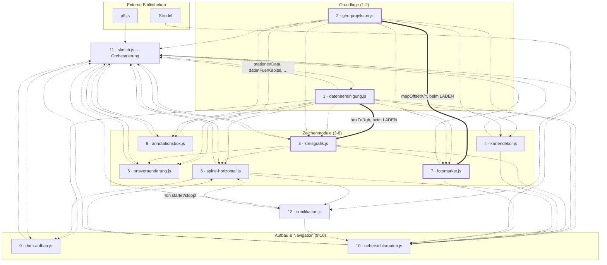
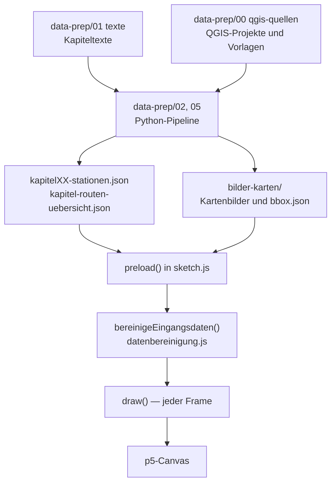

# Architektur

Aufbau der Browser-Anwendung: Ladereihenfolge der Skripte, Aufgabe jedes Moduls
und die Abhängigkeiten zwischen ihnen. Was am aktuellen Stand
verbesserungswürdig ist, steht getrennt davon in
[best-practices-review.md](best-practices-review.md).

**Randbedingung, aus der sich alles Weitere ergibt:** Das Projekt nutzt **keine
ES-Module**. Jede Datei ist ein eigenes `<script>`-Tag, alle Funktionen und
Variablen landen im globalen Scope — **ausser dort, wo eine IIFE sie hält.**
Neun der zwölf Module sind gekapselt und geben nur die genannten Namen über
`window.*` heraus:

| Modul | Exporte |
|---|---|
| `datenbereinigung.js` | 32 |
| `sketch.js` | 28 (11 Wert, 12 Lesebindung, **5 p5-Hooks**) |
| `kreisgrafik.js` | 13 |
| `spine-horizontal.js` | 11 (3 Lesebindungen) |
| `uebersichtsrouten.js` | 10 (3 Lesebindungen) |
| `ortsveraenderung.js` | 8 |
| `sonifikation.js` | 4 (1 Lesebindung) |
| `kartendekor.js` | 3 |
| `annotationsbox.js` | 2 |

Die drei übrigen sind bewusst ungekapselt: Bei ihnen wird **jeder**
Top-Level-Name von aussen gelesen, eine Kapsel müsste also alles exportieren
und nähme dem globalen Scope nichts ab.

| Modul | Top-Level-Namen | davon nur intern | Warum ungekapselt |
|---|---|---|---|
| `geo-projektion.js` | 11 | **0** | Unterste Schicht — `lonLatToScreen`, die drei Bboxen plus `UEBERSICHT_SCHNITT_BBOX`, `mapOffsetX/Y` und die vier Crop-/Bbox-Funktionen werden alle von aussen gebraucht |
| `dom-aufbau.js` | 4 | **0** | Nur die vier `baue*`-Funktionen, alle von `setup()` gerufen |
| `fotomarker.js` | 13 | **0** | Zusätzlicher Blocker: `sketch.js` **schreibt** in sechs dieser Namen (`fotoMarkerListe` in `preload`/`bereinigeEingangsdaten`, die fünf `fotoPopup*`-Handles in `setup`). Eine Kapsel würde diese sieben Zuweisungen wirkungslos machen — sie liefen ins Leere, ohne Fehlermeldung |

Für `fotomarker.js` wäre eine Kapselung also nicht nur nutzlos, sondern
schädlich, solange die Initialisierung in `sketch.js` liegt. Das ist der Rest
der Fremdschreibzugriffe aus Punkt 8 (21 → 7).

**Form der Kapsel** — gilt für alle neun, steht deshalb nur hier und nicht in
jeder Datei:

- **Rumpf nicht eingerückt.** Eine Einrückung um zwei Zeichen würde bei
  Dateien dieser Grösse jede Zeile als geändert markieren: Diff unlesbar,
  `git blame` wertlos. So bleibt der Kapsel-Diff eine reine Einfügung von
  Wrapper und Exportblock.
- **Kein `'use strict'`.** Wäre eine Verhaltensänderung über die Kapselung
  hinaus (undeklarierte Zuweisungen, `this`, doppelte Parameternamen) und
  gehört, wenn überhaupt, in einen eigenen Schritt.
- **Exportblock am Dateiende**, `window.X = X` je Zeile, kein
  Namespace-Objekt — so bleiben die Aufrufstellen in den lesenden Modulen
  unverändert.

**Zwei Regeln, die dabei gelten:**

1. Ist ein exportierter Name **veränderlich** und wird im Modul umgeschaltet,
   steht statt einer Wertzuweisung eine **Lesebindung**
   (`Object.defineProperty` mit `get`). Eine Kopie würde den Startwert
   einfrieren. Bei `sketch.js` betrifft das 17 von 35 Exporten — dort wird
   fast jeder `let` erst in `preload`/`setup`/`draw` gesetzt, also nach dem
   Lauf der IIFE.
2. Die **fünf p5-Hooks** (`preload`, `setup`, `draw`, `mousePressed`,
   `windowResized`) MÜSSEN am `window` liegen — p5 sucht sie dort. Sie stehen
   in der Kapsel und werden wie jeder andere Name exportiert. Fehlte einer,
   bliebe das Bild schwarz, ohne Fehlermeldung.

Bei `datenbereinigung.js` hängt die Ladereihenfolge daran: Es ist Skript 1,
und `kreisgrafik.js` (Skript 3) greift beim Laden auf `hexZuRgb` und
`FWERT_PUNKT_FARBE` zu. Die IIFE läuft sofort und exportiert am Dateiende —
beide Namen liegen also auf `window`, bevor Skript 2 beginnt.

Wo ein exportierter Name **veränderlich** ist und im Modul umgeschaltet wird,
steht statt einer Wertzuweisung eine **Lesebindung** (`Object.defineProperty`
mit `get`) — eine Kopie würde den Startwert einfrieren. Das betrifft
`sonifikationSpieltGerade` sowie `zoomedKapitel`, `kapitelZoomAmount` und
`kapitelHover`. Siehe die Kommentare in den jeweiligen Exportblöcken. Es gibt kein `import`/`export` — wer worauf
zugreift, ist nirgends deklariert, sondern ergibt sich aus der Reihenfolge in
`index.html` und dem Zeitpunkt des Zugriffs.

---

## Kommentar-Konventionen

Gilt für alle zwölf Module. Aufgestellt beim Kommentar-Durchgang im August
2026, der die Kommentarzeilen projektweit von 2260 auf 752 gebracht hat.

**Länge**

- **Jeder Kommentar höchstens 1–2 Zeilen.** Braucht eine Erklärung mehr,
  gehört sie nicht in den Code, sondern nach `docs/` — oder gar nicht
  geschrieben.
- **Ausnahme: Warnung vor einem echten Stolperstein.** Ein Fehler, der sonst
  wiederkehrt, darf 3–4 Zeilen bekommen. Solche Blöcke beginnen mit
  `ACHTUNG` und stehen als eigener Block, nicht mit beschreibendem Text
  verklebt — sonst ist die Warnung im Fliesstext nicht mehr erkennbar.
- **Kopfblock am Dateianfang: 4–5 Zeilen.** Was die Datei macht, grob wie.
  Keine Abhängigkeitslisten — die stehen im Diagramm oben in dieser Datei.

**Inhalt**

- **Nur der Ist-Zustand.** Keine Historie („früher…", „vorher stand hier…"),
  keine Bug-Geschichten, keine verworfenen Alternativen. Was einmal war,
  steht in `docs/cleanup-log.md` und in der Git-Historie.
- **Selbsterklärender Code bekommt keinen Kommentar.** Das Was steht im
  Code; ein Kommentar begründet das Warum oder er entfällt.
- **Offene Stellen ehrlich benennen** statt zu beschönigen — „Ursache
  ungeklärt, nur umgangen" ist eine zulässige und erwünschte Aussage.
- **Konkret statt abstrakt.** Zeilennummern, Funktionsnamen, echte Werte,
  wo sie tragen.

**Prüfbarkeit**

Beim Kürzen zeigte sich wiederholt: Kommentare veralten schneller als Code.
Zwei Dinge deshalb bei jeder Änderung mitprüfen —

- **Dateiangaben.** Verweise wie „`zeichneKreiseFuerRun` in `sketch.js`" waren
  an mehreren Stellen falsch, weil die Funktion längst in einem anderen Modul
  lag. Ein Verweis nennt die Datei nur, wenn sie stimmt.
- **Namen, die es nicht mehr gibt.** Der Durchgang fand rund fünfzehn tote
  Namen in Kommentaren (`aktualisiereGrafik`, `zeichneVergleichsKnoten`,
  `sonifikationSpieltAb`, `baue_kapitel03.py` …). Vor dem Umbenennen oder
  Entfernen eines Namens auch die Kommentare mitsuchen, nicht nur den Code.

---

## Ladereihenfolge

`index.html` lädt zuerst zwei externe Bibliotheken, dann zwölf eigene Dateien:

| # | Datei | Rolle |
|---|---|---|
| — | p5.js 1.9.0 (CDN) | Canvas, Zeichen-API, Lebenszyklus (`preload`/`setup`/`draw`) |
| — | Strudel 1.0.3 (CDN) | Klangsynthese für die Sonifikation |
| 1 | `datenbereinigung.js` | Datenfunktionen und Konstanten, keine Zeichenaufrufe |
| 2 | `geo-projektion.js` | Geografie: Bboxen und Projektion lon/lat → Bildschirm |
| 3 | `kreisgrafik.js` | Kreisdiagramme der Orte |
| 4 | `kartendekor.js` | Routenzug, Massstabsleiste (und die stillgelegte Windrose) |
| 5 | `ortsveraenderung.js` | Schlussakt „Ortsveränderung" |
| 6 | `spine-horizontal.js` | Graph-Ansicht: waagrechte Zeitleiste + Play |
| 7 | `fotomarker.js` | Foto-Marker und Bild-Popup |
| 8 | `annotationsbox.js` | Positionswahl der Annotationsbox |
| 9 | `dom-aufbau.js` | Kapitelregister und Marker-Ebenen |
| 10 | `uebersichtsrouten.js` | Übersichtsakt und Kapitel-Navigation |
| 11 | `sketch.js` | Orchestrierung: `preload`/`setup`/`draw`/`mousePressed` |
| 12 | `sonifikation.js` | Tonspur, synchron zur Graph-Animation |

---

## Abhängigkeitsdiagramm

Durchgezogene Pfeile sind **Ladezeit**-Abhängigkeiten: Sie erzwingen die
Reihenfolge, ein Vertauschen bricht den Start sofort. Gepunktete Pfeile sind
**Laufzeit**-Zugriffe — sie funktionieren unabhängig von der Reihenfolge, weil
sie erst beim Aufruf ausgewertet werden.

**Die beiden Ladezeit-Abhängigkeiten** — empirisch ermittelt, indem jedes Modul
einzeln geladen wurde:

| Modul | braucht beim Laden | aus | Grund |
|---|---|---|---|
| `kreisgrafik.js` | `hexZuRgb` | `datenbereinigung.js` | `const FWERT_PUNKT_FARBE_RGB = hexZuRgb(FWERT_PUNKT_FARBE)` |
| `fotomarker.js` | `mapOffsetX`, `mapOffsetY` | `geo-projektion.js` | `let letzterFotoOffsetX = mapOffsetX, letzterFotoOffsetY = mapOffsetY` |

Alle **zehn übrigen Module laden eigenständig**. Ihre Zugriffe nach aussen
finden ausschliesslich zur Laufzeit statt.

**Zyklen sind vorhanden und tragbar.** `sketch.js` nutzt fast jedes Modul, und
fast jedes Modul greift auf `sketch.js`-Globals wie `stationenData` zu;
ebenso `spine-horizontal.js` ↔ `sonifikation.js` und
`spine-horizontal.js` ↔ `uebersichtsrouten.js`. Das trägt nur, weil **alle**
Zugriffe in beiden Richtungen zur Laufzeit erfolgen. Ein neuer
Top-Level-Initialisierer, der eine fremde Variable liest, kann diese Balance
kippen — deshalb weisen `kreisgrafik.js` und `fotomarker.js` ihre in einem
eigenen Header-Abschnitt aus.

---

## Module im Einzelnen

| # | Modul | Zeilen | Hauptfunktionen | Wichtigste eigene Variablen |
|---|---|---|---|---|
| 1 | `datenbereinigung.js` | 405 | `bereinigeStationenDaten`, `baueSpineDaten`, `sammleAnnotationenNachOrtBasis`, `zaehleBandCounts`, `zaehleAnnotationenLiveNachOrtBasis`, `ortRunsFuerSpine`, `ortRunSichtbar`, `kreisRadius`, `groessterKreisRadius`, `hexZuRgb` | `KREIS_KATEGORIEN`, `SCROLL_MEILENSTEINE`, `ROUTE_COLOR_RGB`, alle `FWERT_*` (auch `FWERT_PUNKT_DURCHMESSER`), beide `FOTO_MARKER_*_RGB`, `KAPITEL_MIT_SPINE_PANEL`, `WOHNUNG_SAMMELPUNKT_ANKER`, `SCHRIFT_SANS`/`SCHRIFT_SERIF` — **gekapselt**, 32 Exporte. Intern: alle drei `GEDANKEN_*`, die übrigen drei `WOHNUNG_*`, die beiden Fotomarker-Hexwerte und `valenzBucket` |
| 2 | `geo-projektion.js` | 96 | `lonLatToScreen`, `coverCrop`, `cropToBbox`, `bboxToImgCrop`, `passeBboxInRahmen` | `startBbox`, `uebersichtBbox`, `ch1ImgBbox`, `UEBERSICHT_SCHNITT_BBOX`, `mapOffsetX`, `mapOffsetY` |
| 3 | `kreisgrafik.js` | 637 | `zeichneKreiseOrtRuns`, `zeichneKreiseFuerRun`, `zeichneFwertPunkte`, `zeichneKreisLabels`, `zeichneDemoKreisgrafik`, `zeichneProjekttextIkon`, `zeichneKreisErklaerung`, `zeichneSchleier`, `demoIkonGetroffen`, `projekttextIkonGetroffen`, `merkeKreis`, `vergissGezeichneteKreise`, `leereBandCounts` | **gekapselt**, 13 Exporte; die übrigen 42 Namen (u. a. `HATCH_SPACING`, `kreisBeschriftungen`, alle `DEMO_*`, `IKON_*` und `ERKLAERUNG_*`) sind modulintern. Beherbergt auch das zweite Icon (Kreis mit Textzeilen): es teilt sich Zeile und Treffertest mit dem Kreisgrafik-Icon |
| 4 | `kartendekor.js` | 314 | `zeichneRoute`, `zeichneMassstabsleiste`, `zeichneWindrose` | — **gekapselt**, 3 Exporte; intern `haversineMeter`, `MASSSTAB_SCHRITTE`, der Routenpuffer und seine Helfer (`routenPufferBereit`, `routenStufenZuege`, `routenStufenAlpha`, alle `ROUTE_*`). `zeichneWindrose` hat derzeit keinen Aufrufer: der Aufruf in `draw()` ist auskommentiert, oben rechts steht das Kreisgrafik-Icon |
| 5 | `ortsveraenderung.js` | 687 | `zeichneOrtsveraenderung`, `ovPhase`, `ovZoomBbox` | `OV_KARTE_AUS`/`OV_ZOOM`/`SK_*`-Phasenfenster — **als einziges Modul gekapselt**, alles Übrige ist modulintern |
| 6 | `spine-horizontal.js` | 548 | `zeichneSpineHorizontal`, `toggleGrafikPlay`, `setzeKapitelAnsichtModus`, `setzeGrafikZurueck`, `stelleSpineDatenBereit`, `spineEintraegeFuer`, `aktuelleGrafikAnimationDauer`, `aktualisiereGrafikFortschritt` | `grafikSpielt`, `grafikFortschritt`, `grafikPlayAusblendStart` (Lesebindungen) — **gekapselt**, intern: beide Spine-Caches, alle `SPINE_*`, `spineLayout` |
| 7 | `fotomarker.js` | 115 | `zeichneFotoMarker`, `merkeKartenlage`, `oeffneFotoPopup`, `schliesseFotoPopup` | `fotoMarkerListe`, `letzteActiveBbox`, `letzterFotoOffsetX/Y`, `FOTO_MARKER_TREFFER_RADIUS`. Zeichnet einen Punkt mit hellem Kern; Grösse abgeleitet aus `FWERT_PUNKT_DURCHMESSER`, Beschriftung über `zeichneKreisLabels` |
| 8 | `annotationsbox.js` | 152 | `annotationBoxPosition` | `ANNOTATION_BOX_POSITIONEN` — **gekapselt**, intern u. a. `annotationBoxPositionCache` |
| 9 | `dom-aufbau.js` | 107 | `baueKapitelRegister`, `baueKartenMarkierungen`, `baueStationsMarker`, `baueZwischenMarker` | — (baut nur DOM, hält keinen Zustand) |
| 10 | `uebersichtsrouten.js` | 372 | `zeichneUebersichtsrouten`, `kapitelScheiben`, `aktualisiereKapitelZoom`, `springeZuKapitelZoom`, `scrolleZuKapitel1` | `zoomedKapitel`, `kapitelZoomAmount`, `kapitelHover` (alle drei als Lesebindung) — **gekapselt**, intern u. a. `kapitelHitze`, `oeffneKapitelZoom`, `scheibenCache` |
| 11 | `sketch.js` | 878 | `preload`, `setup`, `draw`, `mousePressed`, `windowResized`, `datenFuerKapitel`, `kapitelHatEigeneAnsicht`, `setzeAnsichtsModus`, `starteKapitelEinstieg` | `stationenData`, `uebersichtsRouten`, `kapitelAnsichtsModus`, `kreisErklaerungOffen` (Zustand der Erklärungs-Ebene), 8 DOM-Handles (als Lesebindung) — **gekapselt**, intern u. a. `kapitelKarten`, `bgImage`/`bgImage2`/`ch1Image`, die übrigen DOM-Handles |
| 12 | `sonifikation.js` | 370 | `spieleSonifikationFuer`, `beendeSonifikationAudio` | `SONIFIKATION_GESAMTDAUER_SEK`, `sonifikationSpieltGerade` (als Lesebindung) — **gekapselt**, die übrigen 17 Namen (u. a. `baueSpielplan`, `baueGainFolge`, `sonifikationDaten`) sind modulintern |

`dom-aufbau.js` ist das einzige Modul ohne eigene Top-Level-Variablen: es baut
DOM-Knoten und schreibt sie in Handles, die `sketch.js` hält.

Von `sketch.js`' 57 Top-Level-Variablen werden **25 in `setup()` über
`document.getElementById()` befüllt** — fünf davon (`fotoPopup` und die vier
`fotoPopup*`-Unterelemente) sind in `fotomarker.js` deklariert und werden hier
nur gefüllt.

**Scrollgebundene Canvas-Beschriftungen hängen an einem Begleittext.** Ein
`
` in `index.html` trägt das Scroll-Fenster, ein
`data-*`-Attribut macht daraus zusätzlich eine Zeichenanweisung: die drei
`data-demo-gruppe`-Texte steuern die Beschriftungen am Demo-Kreis, der
`data-foto-hinweis`-Text steuert den Bedienhinweis am Fotomarker und nennt
zugleich dessen Titel. So gibt es je Fenster nur eine Zahl, nicht zwei.

**Die Route wird in einen eigenen Puffer gezeichnet, nicht direkt aufs
Canvas** (`zeichneRoute` in `kartendekor.js`). Grund ist der Verlauf: halbdurchsichtige Striche addieren nach
Porter-Duff ihre Deckkraft, wo sie einander berühren — an Stufengrenzen, an
den Kappen und überall, wo die Route sich selbst kreuzt. Im Puffer
(`routenPufferBereit`) wird stattdessen jede Stufe **deckend** gezogen und
überschreibt die vorherige; den Verlauf macht ein Waschgang vor jeder Stufe
(`erase`, also `destination-out`), der allem bisher Gezeichneten anteilig
Deckkraft nimmt. Die Waschstärken leiten sich aus `routenStufenAlpha()` ab und
bilden dieselbe lineare Rampe wie zuvor exakt nach.

Die Stufen schneidet `routenStufenZuege()` nach **Bogenlänge in
Bildschirmpixeln** (`ROUTE_SCHWEIF_PX`), nicht nach Wegpunkt-Indizes: an die
Punktdichte gebunden schwankte die Schweiflänge zwischen den Kapiteln um
Faktor 13. Grenzen werden ins Segment interpoliert, damit benachbarte Züge
exakt aneinander anschliessen. Der Puffer trägt keinen `alphaMultiplier` — der
kommt erst beim Auflegen als `tint()`, damit er die Einblendung eines Kapitels
ohne Neuaufbau übersteht.

**Kapitel 1 endet an einer Klemme.** `uebersichtRoutenStart` ist zugleich das
Ende von Kapitel 1: `draw()` hält die Scrollposition dort fest
(`klemmeScroll`), einen Rauszoom-Akt gibt es nicht mehr. In den Übersichtsakt
führt nur ein Klick — `springeZurUebersicht()` und `springeZuKapitelZoom()`
rufen dafür `loeseKapitel1Klemme()`, sonst zöge der nächste Frame sofort
zurück. Ein Zurückscrollen unter die Marke setzt die Klemme neu. An demselben
Merker hängt `zoomOutAmount`: solange die Klemme steht, liegt die Karte in
Kapitel 1, danach auf der Überblickskarte — ein Schnitt, keine Rampe, weil der
Sprung selbst ein Schnitt ist.

Vor der Klemme liegen zwei Strecken: 140 vh Projekttext-Einblender ab
`routeEnd`, dann ab `kapitelEndeStart` 100 vh Kartenansicht mit Hinweis und
den beiden Kapitelbuttons. **Sichtbar wird dieses Kapitelende aber nicht an
einer Scrollmarke, sondern sobald der Projekttext zu ist** — sonst zeigte der
Weg über das Schliesskreuz die blanke Karte, bis man bis zur Klemme
durchgescrollt hätte. Die Marke begrenzt nur, wie weit das Panel den Scroll
für sich behält.

**Zwei Einblender, ein Mechanismus.** Beide legen dieselbe Fläche über die
Ansicht (`zeichneSchleier`) und werden vom selben Klickpfad in `mousePressed()`
geschaltet; unterschiedlich sind nur Farbe und Inhalt. Die Legende beschriftet
hell die echte Kreisgrafik im Canvas, der Projekttext legt dunkel auf und zeigt
darauf die DOM-Textfläche `#projekttext` — Prosa bleibt im DOM, wo im Projekt
alle Prosa liegt. Der Projekttext hat zwei Wege hinein (automatisch am Ende der
Route, jederzeit über sein Icon) und trägt deshalb zwei Merker: `projekttextPerIkon`
und `projekttextWeggeklickt`; `projekttextOffen` wird je Frame daraus abgeleitet.

**Die Erklärungs-Ebene der Kreisgrafik** liegt ganz in `kreisgrafik.js`:
`merkeKreis()` sammelt je Frame, was Karte (`zeichneKreiseOrtRuns`) und
Graph-Ansicht (`zeichneSpineHorizontal`) an echten Ortskreisen gezeichnet
haben, `zeichneKreisErklaerung()` beschriftet daraus den grössten. `sketch.js`
hält nur den Auf/Zu-Zustand (`kreisErklaerungOffen`) und ruft
`demoIkonGetroffen()` in `mousePressed()`. Die Beschriftungen entstehen im
selben `zeichneKreisLabels()`, das auch die Ortsnamen auf der Karte setzt.

---

## Was `preload()` lädt

`preload()` in `sketch.js` lädt alles, bevor der erste Frame gezeichnet wird —
**20 Bilder und 37 JSON-Dateien**.

**Bilder** (alle in `bilder-karten/`):

| Datei | Variable | Verwendung |
|---|---|---|
| `paris-startkarte-web.png` | `bgImage` | Startseite und Schlusskarte |
| `paris-ueberblickkarte-web.png` | `bgImage2` | Übersichtsakt mit allen 18 Routen |
| `kapitel01-qgis-karte-web.png` | `ch1Image` | Kapitel-1-Kartenausschnitt |
| `kapitelXX-karte.png` (17×, Kapitel 02–18) | `kapitelKarten[nr].bild` | Kartenausschnitt je Kapitel |

**Daten:**

| Datei | Variable | Inhalt |
|---|---|---|
| `kapitelXX-stationen.json` (18×, Kapitel 01–18) | `stationenData` (01), `kapitel03Data` (03), `weitereKapitelDaten[nr]` | Annotationen, Route, ortRuns je Kapitel |
| `kapitel-routen-uebersicht.json` | `uebersichtsRouten` | Strassenrouten aller Kapitel für den Übersichtsakt |
| `fotomarker.json` | `fotoMarkerListe` | Koordinaten und Metadaten der Fotobank-Marker |
| `bilder-karten/kapitelXX-bbox.json` (17×) | `kapitelKarten[nr].bboxRaw` | Georeferenz des jeweiligen Kartenausschnitts |

Kapitel 1 hat **kein** `bbox.json`: seine Georeferenz steht als Literal
`ch1ImgBbox` in `geo-projektion.js`. Die Kapitelkarten 02–18 samt ihren
bbox-Dateien erzeugt die Python-Pipeline
(`data-prep/05 bereinigen/schneide-kapitelkarten.py`).

---

## Datenfluss von der Quelle zum Bild

---

## Wie diese Übersicht entstanden ist

Die Angaben sind aus dem Code erhoben, nicht aus den Kommentaren übernommen:

- **Ladereihenfolge:** direkt aus den `<script src="…">`-Tags in `index.html`.
- **Funktionen und Variablen:** Top-Level-Deklarationen je Datei, auf
  kommentarbereinigtem Quelltext gezählt (inklusive `async function`).
- **Ladezeit-Abhängigkeiten:** jedes Modul einzeln in JavaScriptCore geladen —
  wer dabei einen `ReferenceError` wirft, braucht ein früher geladenes Modul.
  Genau zwei tun das.
- **Laufzeit-Abhängigkeiten:** für jedes Modul geprüft, welche Namen es
  verwendet, die ein anderes Modul deklariert.
