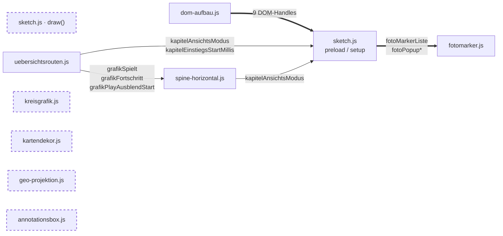
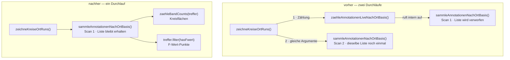

# Best-Practice-Review

Prüfung des Codes gegen fünf Kriterien: globale Variablen, Single
Responsibility, toter Code, DRY und der `draw()`-Loop. Geprüft wurde der Stand
vom 22. August 2026 über alle zwölf Module (4532 Zeilen) plus `index.html`.

**Stand der Umsetzung.** Der Befund wurde am 22. August 2026 erhoben. Seither
umgesetzt: die Konsolidierung der Radius-Formel samt der beiden daran
hängenden Befunde (Rückgabewert von `zeichneKreiseFuerRun()`, Namensverdeckung
in `zeichneFwertPunkte()`), der doppelte Vollscan pro Frame samt dem
doppelten `wohnungFilterFuerOrt()`-Aufruf, die drei Canvas-Zustands-Befunde
in `kreisgrafik.js` (dort klammern sich jetzt alle sechs zeichnenden
Funktionen einheitlich mit `push()`/`pop()`) sowie die Fremdschreibzugriffe
aus `draw()` samt dem `kapitelHover`-Knoten. Die betroffenen Zeilen unten sind als **erledigt**
markiert und tragen die Fundstelle im heutigen Code. Alles Übrige steht
unverändert offen. Die Namensverdeckung wurde bei dieser Gelegenheit erstmals
systematisch über alle Module geprüft — Ergebnis unter
[Globale Variablen](#namensverdeckung-systematisch-nachgeprüft).

**Randbedingung, die jede Bewertung hier färbt:** Das Projekt nutzt keine
ES-Module (siehe [architektur.md](architektur.md)). Jeder Name landet im
globalen Scope. „Modulintern" heisst deshalb nirgends *technisch* gekapselt,
sondern nur: faktisch greift kein anderes Modul darauf zu.

---

## Priorisierte Gesamtliste

| Nutzen | Befund | Kriterium |
|---|---|---|
| **hoch** | ~~Dieselbe Radius-Formel liegt fünfmal im Code, an vier Stellen als Kopie~~ — **erledigt**, jetzt `groessterKreisRadius()` in `datenbereinigung.js:340` | DRY |
| **hoch** | ~~Pro Frame und Ortskreis wird `daten.annotationen` zweimal vollständig durchlaufen~~ — **erledigt**, jetzt ein Scan über `zaehleBandCounts()` | DRY |
| **hoch** | ~~`zeichneKreiseFuerRun()` liefert den Radius nur als Nebenprodukt des Zeichnens~~ — **erledigt**, die Funktion gibt nichts mehr zurück | Single Responsibility |
| **hoch** | ~~Parameter `kreisRadius` verdeckt die gleichnamige globale Funktion~~ — **erledigt**, heisst jetzt `radius` | Globale Variablen |
| **mittel** | ~~`draw()` schreibt in Variablen von drei fremden Modulen~~ — **erledigt**, alle fünf Zugriffe verlagert | Globale Variablen |
| **mittel** | ~~`zeichneKreisLabels()` setzt sechs p5-Zeichenzustände und stellt keinen zurück~~ — **erledigt**, `push()`/`pop()` | Single Responsibility |
| **mittel** | ~~`zeichneUebersichtsrouten()` zeichnet und setzt dabei `kapitelHover`~~ — **erledigt**, `draw()` zieht nichts mehr nach | Single Responsibility |
| **mittel** | 110 der 254 globalen Namen werden nur in ihrem eigenen Modul gebraucht | Globale Variablen |
| **mittel** | Kapitel-1-Datenregeln stehen im Zeichenmodul `kreisgrafik.js` | Single Responsibility |
| **mittel** | ~~`zeichneHalbkreis`/`zeichneVollkreis` setzen `globalCompositeOperation` hart zurück~~ — **erledigt**, `push()`/`pop()` | Single Responsibility |
| **niedrig** | `draw()` läuft mit 557 Zeilen als eine Funktion | Single Responsibility |
| **niedrig** | `noLoop()`/`redraw()` wäre möglich, aber der Umbau ist gross und der Gewinn klein | draw()-Loop |
| **niedrig** | Farbwerte aus `KREIS_KATEGORIEN` werden an drei Stellen in drei Formate übersetzt | DRY |
| **niedrig** | Das Font-Literal `'Source Sans 3', sans-serif` steht zwölfmal im Code | DRY |
| **niedrig** | ~~`wohnungFilterFuerOrt()` wird zweimal mit demselben Argument aufgerufen~~ — **erledigt** | DRY |
| **niedrig** | Sechs Stellen verdecken p5-Globals (`color`, `text` ×3, `max`, `key`) — alle heute wirkungslos | Globale Variablen |
| — | **Toter Code: nichts gefunden.** Alle 82 Funktionen sind erreichbar | Toter Code |

---

## Globale Variablen

Alle zwölf Module deklarieren zusammen **254 Namen im globalen Scope**: 82
Funktionen und 172 Variablen/Konstanten. Davon werden **115 nur im eigenen
Modul gebraucht**. Fünf davon sind p5-Lebenszyklus-Hooks (`preload`, `setup`,
`draw`, `mousePressed`, `windowResized`), die global bleiben *müssen*, weil p5
sie am `window` sucht — bleiben **110 echte Kandidaten** für Modul-Scope.

### Wie viel jedes Modul nach aussen gibt

| Modul | Namen gesamt | nur modulintern | extern genutzt | Anteil intern |
|---|---|---|---|---|
| `ortsveraenderung.js` | 44 | 36 | 8 | 81 % |
| `sonifikation.js` | 20 | 15 | 5 | 75 % |
| `annotationsbox.js` | 7 | 5 | 2 | 71 % |
| `kreisgrafik.js` | 13 | 8 | 5 | 61 % |
| `spine-horizontal.js` | 22 | 12 | 10 | 54 % |
| `kartendekor.js` | 4 | 2 | 2 | 50 % |
| `uebersichtsrouten.js` | 15 | 6 | 9 | 40 % |
| `sketch.js` | 66 | 25 | 41 | 37 % |
| `datenbereinigung.js` | 35 | 6 | 29 | 17 % |
| `geo-projektion.js` | 9 | 0 | 9 | 0 % |
| `fotomarker.js` | 13 | 0 | 13 | 0 % |
| `dom-aufbau.js` | 6 | 0 | 6 | 0 % |

`geo-projektion.js`, `fotomarker.js` und `dom-aufbau.js` geben alles nach
aussen — bei ihnen ist nichts zu kapseln. Sie sind reine Werkzeugkästen.

### Kandidaten für Modul-Scope

| Fundstelle | Befund | Priorität | Begründung |
|---|---|---|---|
| `ortsveraenderung.js:42-302` | 37 von 45 Namen sind modulintern: `VERGLEICHS_KNOTEN`, 24 `OV_*`-Konstanten, `ovProKapitel`, `ovRohradien`, `ovErstesKapitel`, `ovLayout` und sieben `ov*`-Funktionen | mittel | Grösster Einzelposten. Nach aussen braucht das Modul nur acht Namen: `ovPhase`, `ovZoomBbox`, `zeichneOrtsveraenderung` und die fünf Phasenfenster `OV_KARTE_AUS`, `OV_ZOOM`, `SK_EINBLENDEN`, `SK_RAUSZOOM`, `SK_TEXT`. Eine IIFE mit acht Rückgaben würde 36 Namen aus dem globalen Scope nehmen. Auch `ovBerechneLayout` bleibt modulintern, obwohl [architektur.md](architektur.md) es als Hauptfunktion führt |
| `sonifikation.js:44-184` | 15 von 20 Namen modulintern, darunter der gesamte Zustand (`sonifikationDaten`, `sonifikationBereit`, `sonifikationSpielplan`, `sonifikationTimeoutId`) | mittel | Das Modul ist bereits sauber geschnitten — es lädt zuletzt und niemand greift auf seine Interna zu. Kapselung ist hier reine Formsache und entsprechend risikoarm |
| `spine-horizontal.js:150-178` | Die neun `SPINE_*`-Layoutkonstanten, `spineLayoutCache`, `spineLayout()` und `grafikStartZeit` sind modulintern | mittel | `SPINE_RAND_LINKS` und Konsorten sind Layout-Details, die im globalen Namensraum nichts verloren haben |
| `kreisgrafik.js:56-333` | `HATCH_SPACING`, `drawHatchedCircle`, `zeichneKreisLabels`, `zeichneHalbkreis`, `zeichneVollkreis` sowie `FWERT_PUNKT_FARBE_RGB` und die beiden `FWERT_PUNKT_*_ABSTAND`-Konstanten sind modulintern | mittel | Vier davon sind Zeichen-Primitive, die nur `zeichneKreiseFuerRun` und `zeichneKreiseOrtRuns` aufrufen. `FWERT_PUNKT_DURCHMESSER` muss dagegen global bleiben — `dom-aufbau.js:212` baut die Legende daraus |
| `sketch.js:6-158` | 25 Namen modulintern, u. a. `bgImage`, `bgImage2`, `ch1Image`, `kapitel03Data`, `weitereKapitelDaten`, `letzterZoomKapitel` und sechs DOM-Handles (`heroText`, `begleitTexte`, `kapitelEinstiegsTexte`, `annotationBoxEl`, `schlusstextEl`, `naechstesKapitelEl`) | niedrig | Hier ist der Nutzen am kleinsten: `sketch.js` muss die fünf p5-Hooks global lassen, eine IIFE ginge also nur um sie herum. Der Aufwand steht in schlechtem Verhältnis zum Gewinn |
| `uebersichtsrouten.js:87-513` | `KAPITEL_SCHEIBE_GRUNDANTEIL`, `KAPITEL_NACHGLUEHEN`, `scheibenCache`, `kapitelHitze`, `setzeKapitelAnsichtZurueck`, `oeffneKapitelZoom` | niedrig | Kleiner Posten, und `oeffneKapitelZoom` ist trotz nur interner Nutzung ein Name, den man beim Lesen erwartet |
| `datenbereinigung.js:92-352` | `WOHNUNG_SPLIT_ANNOTATION_ID`, `WOHNUNG_VOR_SPLIT_FILTER`, `RUE_NOTRE_DAME_FILTER`, `GEDANKEN_FILTER`, `GEDANKEN_ZIEL_ORT`, `valenzBucket` | niedrig | Sechs von 34 — das Modul ist als gemeinsame Grundlage gedacht und gibt zu Recht fast alles heraus |
| `annotationsbox.js:54-58` | Die vier Mass-Konstanten und `annotationBoxPositionCache` | niedrig | Nur fünf Namen; das Modul ist ohnehin das kleinste |
| `kartendekor.js:25-36` | `haversineMeter`, `MASSSTAB_SCHRITTE` | niedrig | Zwei Namen. `geo-projektion.js:34` verweist ausdrücklich auf `haversineMeter` — beim Kapseln müsste dieser Kommentar mit |

### Zwei Befunde, die nicht nur Kosmetik sind

| Fundstelle | Befund | Priorität | Begründung |
|---|---|---|---|
| ~~`kreisgrafik.js:345`~~ → `kreisgrafik.js:353` | **Erledigt.** Der dritte Parameter von `zeichneFwertPunkte()` hiess `kreisRadius` und verdeckte die gleichnamige globale Funktion aus `datenbereinigung.js:320`, die vier Module benutzen. Er heisst jetzt `radius` | **hoch** | Im Rumpf war `kreisRadius` die Zahl, nicht die Funktion. Unschädlich nur, solange dort niemand die Funktion braucht — mit `groessterKreisRadius` daneben wäre die Stelle zusätzlich verwirrend geworden |
| ~~`sketch.js:281, 386, 505, 812-814`~~ | **Erledigt.** `draw()` schrieb in Variablen dreier fremder Module — faktisch fünf Zugriffe, denn `:295` schrieb zusätzlich in `spineEintraegeKapitel[…]`. Alle sind in ihr besitzendes Modul gewandert: `aktualisiereKapitelZoom()` und der Hover-Guard in `uebersichtsrouten.js`, `merkeKartenlage()` in `fotomarker.js`, `stelleSpineDatenBereit()` in `spine-horizontal.js`. `draw()` schreibt jetzt nur noch eigene Variablen (`letzterZoomKapitel`, `kapitel1ZoomAmount`) | mittel | Das war die eigentliche Hürde vor jeder Kapselung. Sie ist weg — die Lesezugriffe von aussen bleiben und stören erst bei einer echten IIFE-Umstellung |

### Namensverdeckung: systematisch nachgeprüft

Der Befund oben war ein Zufallsfund beim Detaillesen von `kreisgrafik.js`, kein
Suchergebnis. Nachgeholt: alle Parameter, Pfeilfunktions-Parameter,
Destrukturierungen und lokalen `let`/`const`/`var` aller zwölf Module gegen die
254 globalen Projektnamen gehalten.

**Verdeckungen von Projektnamen: null.** `kreisRadius` war die einzige, und sie
ist behoben. Sechs Stellen verdecken p5-Globals — alle sind heute wirkungslos,
weil das Projekt den verdeckten Namen an keiner Stelle benutzt oder ihn nur in
einer anderen Datei benutzt:

| Fundstelle | Verdeckt | Priorität | Warum es heute nichts ausmacht |
|---|---|---|---|
| `kreisgrafik.js:62` | p5s `color()` — Parameter `color` von `drawHatchedCircle()` | niedrig | Von den sechs die einzige mit realem Restrisiko: `color()` wird im Projekt tatsächlich aufgerufen (`fotomarker.js:81-82`), und `drawHatchedCircle` ist eine Zeichenfunktion, in der ein `color()`-Aufruf plausibel wäre. Nur: er steht dort nicht, und die Verdeckung wirkt ausschliesslich in diesem einen Rumpf |
| `ortsveraenderung.js:176` | p5s `text()` — Parameter `text` von `ovTextUmbruch()` | niedrig | **p5s `text()` wird im ganzen Projekt kein einziges Mal aufgerufen.** Wegen des dokumentierten Unsichtbarkeits-Bugs läuft aller Text über `drawingContext.fillText()` (13 Stellen). Die Falle kann nicht zuschnappen, solange diese Regel gilt |
| `ortsveraenderung.js:198` | p5s `text()` — Parameter `text` von `ovLabelZeilen()` | niedrig | Wie oben. Beide Funktionen sind reine String-Helfer, die nur `textWidth()` brauchen |
| `dom-aufbau.js:206` | p5s `text()` — destrukturierter Parameter `{ groesse, text }` | niedrig | Wie oben, zusätzlich: `dom-aufbau.js` baut DOM-Knoten und zeichnet nie auf den Canvas |
| `ortsveraenderung.js:412` | p5s `max()` — lokales `let max` in `ueberstand` | niedrig | p5s `max()`/`min()` werden im Projekt nie benutzt; gerechnet wird durchgehend mit `Math.max` (28×) und `Math.min` (20×). Die Konvention schützt die Stelle |
| `uebersichtsrouten.js:309` | p5s `key` — lokales `let key` | niedrig | p5s `key` wird nirgends gelesen; der Tastatur-Handler in `sketch.js:250` nimmt `e.key` vom DOM-Event |

Keine dieser sechs erreicht das Gewicht des behobenen Falls. Dort ging es um
eine **Projektfunktion**, die vier Module benutzen und die drei Zeilen entfernt
in derselben Datei aufgerufen wird — hier um p5-Namen, die das Projekt
entweder gar nicht oder nur in anderen Dateien anfasst.

### Wer in wessen Zustand schreibt

Das Abhängigkeitsdiagramm in [architektur.md](architektur.md#abhängigkeitsdiagramm)
zeigt *Lesezugriffe*. Für die Frage nach kapselbarem Zustand zählt die
Gegenrichtung — sie sieht anders aus. Der Stand nach der Kapselung:

Dicke Pfeile sind **einmalige Initialisierung** (`preload`/`setup`/
`bereinigeEingangsdaten`), dünne sind **Ereignis-Handler**. Die einmaligen
sind unkritisch und in [architektur.md](architektur.md) als Muster
beschrieben: `dom-aufbau.js` baut DOM-Knoten und legt sie in `sketch.js`-
Handles ab, `preload`/`setup` füllen die `fotomarker.js`-Handles.

**`draw()` schreibt in keine fremde Modulvariable mehr.** Bis zur Kapselung
liefen fünf Zugriffe je Frame von dort nach aussen — sie sind zu
`aktualisiereKapitelZoom()`, `merkeKartenlage()`, `stelleSpineDatenBereit()`
und dem Hover-Guard in `zeichneUebersichtsrouten()` geworden.

Gestrichelt: **`kreisgrafik.js`, `kartendekor.js`, `geo-projektion.js`,
`annotationsbox.js`** schreiben in keinen fremden Zustand — und, ausser dem
Cache in `annotationsbox.js`, auch in keinen eigenen. Sie liessen sich als
erste kapseln.

**Was bleibt:** das Dreieck aus Ereignis-Handlern.
`setzeKapitelAnsichtZurueck()` (uebersichtsrouten.js) schreibt in vier
Variablen von `spine-horizontal.js` und `sketch.js`,
`setzeKapitelAnsichtModus()` (spine-horizontal.js) zurück in `sketch.js`.
Anders als die Frame-Schreibzugriffe laufen diese nur bei Klicks — sie sind
kein Dauerzustand, aber vor einer IIFE-Umstellung müssten auch sie aufgelöst
werden.

---

## Single Responsibility

Geprüft wurde `kreisgrafik.js` im Detail, ergänzt um die Gegenprobe über alle
Module: Welche Funktion verändert modulweiten Zustand, und zeichnet sie
gleichzeitig?

### Vorab: zwei Annahmen aus der Fragestellung stimmen nicht

**Einen Toggle für neutrale F-Werte gibt es im Code nicht.** Neutrale und
unbewertete F-Wert-Annotationen werden nicht geschaltet, sondern fest in das
dritte 120°-Drittel einsortiert (`kreisgrafik.js:361-372`). Die einzigen
Umschalter im Projekt sind `setzeKapitelAnsichtModus()` (Karte/Graph) und
`toggleGrafikPlay()`, beide in `spine-horizontal.js` — und beide sind
Event-Handler ohne Zeichenaufruf, also gerade *keine* Vermischung.

**`kreisgrafik.js` verändert überhaupt keinen Modul-Zustand.** Die Datei hat
kein einziges `let` auf oberster Ebene; alle fünf Top-Level-Namen sind `const`
(`kreisgrafik.js:56`, `:330-333`), vier davon Literale, einer ein
`hexZuRgb()`-Aufruf. Die gesuchte Vermischung
„zeichnet UND verändert State" gibt es dort in dieser Form nicht.

Was es stattdessen gibt, sind zwei andere Vermischungen — geteilter
Canvas-Zustand und Zeichnen-plus-Messen:

| Fundstelle | Befund | Priorität | Begründung |
|---|---|---|---|
| ~~`kreisgrafik.js:271-326`~~ → `kreisgrafik.js:279` | **Erledigt.** `zeichneKreiseFuerRun()` zeichnete und gab zugleich `groessterHatchRadius` zurück — ein Nebenprodukt der Zeichenschleife. Die Funktion gibt jetzt nichts mehr zurück und holt den Wert vorab über `groessterKreisRadius()` (`:293`); die drei Aufrufer tun dasselbe | **hoch** | Das war die Ursache der fünf Formel-Kopien: Wer die Grösse VOR dem Zeichnen brauchte, musste sie nachbauen. In `spine-horizontal.js` wurde die Zeichenschleife dabei einfacher — der Wert lag dort als `k.radius` längst bereit |
| ~~`kreisgrafik.js:166-171`~~ → `kreisgrafik.js:206` | **Erledigt.** `zeichneKreisLabels()` setzte `noStroke()`, `fill()`, `textFont()`, `textSize()`, `textStyle(BOLD)` und `textAlign()` und stellte keinen davon zurück. Steht jetzt zwischen `push()` und `pop()` | mittel | Der Zustand leckte in alles, was danach zeichnete — nachweislich: der Kommentar bei `uebersichtsrouten.js:334-338` nennt genau diese Funktion als Ursache dafür, dass die Kapitel-Badges ihre Deckkraft erbten |
| ~~`kreisgrafik.js:200-212`~~ → `kreisgrafik.js:241-246` | **Erledigt an der Ursache.** `zeichneKreiseFuerRun()` und `zeichneFwertPunkte()` klammern sich jetzt selbst; ihr `pop()` gleicht p5s Zwischenspeicher wieder ab. Die Direktzuweisung in `zeichneKreisLabels` blieb bewusst stehen — dort wird ohnehin über `drawingContext.fillText` gezeichnet und die Farbe wechselt je Label. Ihr Kommentar nennt jetzt diesen Grund statt des früheren Notbehelfs | mittel | Die Umgehung sass beim Opfer, nicht bei der Ursache |
| ~~`kreisgrafik.js:229-240`, `245-254`~~ → `kreisgrafik.js:276`, `:293` | **Erledigt.** Beide setzten `globalCompositeOperation` nach dem Zeichnen hart auf `'source-over'`. Jetzt `push()`/`pop()` — der vorherige Wert wird wiederhergestellt statt angenommen | mittel | Auch `drawHatchedCircle` (`:91`) wurde von `ctx.save()`/`restore()` auf `push()`/`pop()` umgestellt: `restore()` stellt den Canvas zurück, lässt p5s Zwischenspeicher aber falsch |
| `kreisgrafik.js:98-111` | `zeichneKreiseOrtRuns()` wendet Kapitel-1-Datenregeln an: `WOHNUNG_SAMMELPUNKT_ABSORBIERTE_ORTRUNS`, `GEDANKEN_ORTRUN_UNTERDRUECKT` und die `RUE_NOTRE_DAME_DE_LORETTE_ORT`-Sonderbehandlung, abgesichert über `daten === stationenData` | mittel | Das sind Regeln über die Daten, keine Zeichenentscheidungen. Sie gehören zu ihren Geschwistern in `datenbereinigung.js:90-157`. Der eigene Kommentar (`:100-106`) erklärt, wie fragil die Absicherung ist: die Sets sind reine Namenslisten ohne Kapitelbezug, und ohne den `daten === stationenData`-Test würde etwa Kapitel 3 seinen „Parc Monceau" verlieren |
| `kreisgrafik.js:93-151` | `zeichneKreiseOrtRuns()` filtert, projiziert, zählt, zeichnet und sammelt zugleich Label-Kandidaten für die anschliessende Kollisionsauflösung | mittel | Fünf Aufgaben in 58 Zeilen. Der Schnitt zwischen Sammeln und Zeichnen ist bereits angelegt (`labelKandidaten` → `zeichneKreisLabels`) — er müsste nur konsequent bis zur Auswahl der Orte durchgezogen werden |

### Gegenprobe über alle Module

Über alle zwölf Module gibt es **genau eine** Funktion, die zeichnet und dabei
modulweiten Zustand setzt:

| Fundstelle | Befund | Priorität | Begründung |
|---|---|---|---|
| ~~`uebersichtsrouten.js:291, 390, 452`~~ → `uebersichtsrouten.js:144` | **Erledigt.** `zeichneUebersichtsrouten()` wird jetzt unbedingt aufgerufen und übernimmt den Fall „wird nicht gezeichnet" selbst: bei `fortschritt <= 0` setzt sie Hover und Cursor zurück und steigt aus. Der `else`-Zweig in `draw()` ist ersatzlos entfallen | mittel | Kein `hoverZielUnterMaus()` extrahiert: Der Treffertest hängt an der Startpunkt-Geometrie samt Streuung deckungsgleicher Punkte, die erst im Zeichendurchlauf entsteht — ein Extrakt hätte sie dupliziert, also genau die Art Kopie, die dieses Review sonst bekämpft |
| `sketch.js:277-833` | `draw()` ist 557 Zeilen lang und deckt Scroll-Akte, Kapitel-Zoom, Annotationsbox, Legende, Kapitelregister, Foto-Marker und Schlussakt ab | niedrig | Ein echter Befund, aber kein lohnender: Die Abschnitte teilen sich durchgehend Zwischenwerte (`activeBbox`, `zoomAmount`, `scrollFortschritt`), ein Aufteilen erzeugt vor allem lange Parameterlisten. Der Nutzen wäre Lesbarkeit, das Risiko real |

`ovBaueDaten()` und `ovBerechneLayout()` (`ortsveraenderung.js:244`, `:302`)
schreiben zwar Modulzustand, zeichnen aber nicht — sie sind memoisierte
Vorberechnungen und damit sauber getrennt. Dasselbe gilt für
`kapitelScheiben()` (`uebersichtsrouten.js:90`), `spineLayout()`
(`spine-horizontal.js:178`) und `annotationBoxPosition()`
(`annotationsbox.js:60`) — alle drei schreiben ausschliesslich in ihren
eigenen Cache.

---

## Toter Code

**Gefunden: nichts.** Alle 82 Funktionen des Projekts sind erreichbar.

| Fundstelle | Befund | Priorität | Begründung |
|---|---|---|---|
| alle 12 Module | 82 von 82 Funktionen erreichbar, keine ungenutzte Funktion | — | Über einen Aufruf-Graphen aller Module ermittelt, nicht dateiweise geraten. Ausgangspunkte: die fünf p5-Hooks plus die beiden Ladezeit-Aufrufe `hexZuRgb` und `wohnungSplitAi` |
| `sketch.js:167, 206, 264, 277, 834` | `preload`, `setup`, `windowResized`, `draw`, `mousePressed` werden nirgends im Projekt aufgerufen | — | **Kein toter Code.** p5 sucht diese Namen am `window` und ruft sie selbst. Eine reine Textsuche meldet sie fälschlich als ungenutzt |
| `sketch.js:15` | `naechstesKapitel()` — Textsuche findet einen Treffer in `index.html:43` | — | **Falscher Treffer:** Das ist das `id`-Attribut `naechstesKapitel`, kein Aufruf. Die Funktion ist trotzdem lebendig, aufgerufen aus `sketch.js:220` (Klick-Handler) und `sketch.js:593` (`draw`) |
| `sketch.js:54` | `WEITERE_KAPITEL_NUMMERN` erscheint bei naiver Suche ungenutzt | — | **Falscher Treffer:** Alle drei Nutzungen stehen hinter einem Spread — `...WEITERE_KAPITEL_NUMMERN` in `sketch.js:175`, `sketch.js:196` und `dom-aufbau.js:107`. Ein Muster, das Punkt-Zugriffe ausschliesst, verwirft sie mit |

Die letzten drei Zeilen stehen hier, weil sie bei jeder Wiederholung dieser
Prüfung erneut auffallen werden: Eine reine Textsuche meldet fünf Funktionen
und eine Konstante als ungenutzt — keine davon ist es.

Nicht geprüft wurde toter Code *innerhalb* lebender Funktionen — unerreichbare
Zweige, Bedingungen, die nie greifen. Das braucht Laufzeitmessung, keine
statische Suche.

---

## DRY

### Die Radius-Formel lag fünfmal im Code — erledigt

Fünf Stellen berechneten „grösster Kreisradius über alle Kategorien" aus
denselben `bandCounts`, nach derselben Formel
`max(kreisRadius(neg + pos + neutral + unrated))` über `KREIS_KATEGORIEN`.
Sie sind zu **`groessterKreisRadius(bandCounts, maxRadius = 100, radiusSkala = 1)`**
in `datenbereinigung.js:340` zusammengelegt — dort, weil die Funktion
`KREIS_KATEGORIEN` und `kreisRadius` direkt nebenan vorfindet und weil alle
vier Aufrufer ohnehin an `datenbereinigung.js` hängen: der Umzug hat **keine
einzige neue Modul-Abhängigkeit** erzeugt.

| vorher | jetzt | Argumente |
|---|---|---|
| `kreisgrafik.js:284-288` (in der Zeichenschleife) | `kreisgrafik.js:293` | `maxRadius`, `radiusSkala` durchgereicht |
| `spine-horizontal.js:359-366` | `spine-horizontal.js:355` | Vorgaben |
| `spine-horizontal.js:191-196` | `spine-horizontal.js:191` | Vorgaben |
| `annotationsbox.js:83-87` | `annotationsbox.js:86` | Vorgaben |
| `ortsveraenderung.js:235-243` (`ovRadiusAus()`) | `ortsveraenderung.js:258`, `:265`, `:526` | `Infinity`, teils mit `kreisSkala` |

**Nebeneffekt:** `spine-horizontal.js`, `annotationsbox.js` und
`ortsveraenderung.js` nutzten `KREIS_KATEGORIEN` und `kreisRadius`
ausschliesslich an diesen Stellen. Alle drei Module haben dadurch zwei externe
Abhängigkeiten verloren und eine gewonnen; ihre Header-Blöcke sind
entsprechend nachgeführt.

**Ein Stolperstein bleibt und ist an beiden Stellen vermerkt:**
`groessterKreisRadius(…, maxRadius, radiusSkala)` und
`zeichneKreiseFuerRun(…, radiusSkala, maxRadius)` nehmen die beiden Parameter
in umgekehrter Reihenfolge. Der Vorrang lag auf der Ergonomie — `maxRadius`
wird überschrieben (`Infinity` im Schlussakt), `radiusSkala` fast nie.

**Bilanz:** In den fünf berührten Dateien sind **15 Code-Zeilen netto
verschwunden** (1020 → 1005, kommentarbereinigt gezählt). Die Dateien sind
trotzdem um 18 Zeilen *länger* geworden — die neue Funktion trägt 33 Zeilen
Kommentar, der erklärt, warum sie in `datenbereinigung.js` steht, was
`maxRadius`/`radiusSkala` bedeuten und dass ihre Parameterreihenfolge zu
`zeichneKreiseFuerRun()` umgekehrt ist. Der Gewinn liegt nicht in der
Zeilenzahl, sondern darin, dass die Formel nur noch einmal existiert.

**Nachgewiesen gleichwertig:** alle fünf alten Implementierungen wurden gegen
die neue Funktion laufen gelassen, über 584 echte `bandCounts` aus allen 18
Kapiteln (Zwischen- und Endstände) plus Randfälle — leer, Teilkategorien,
Werte über dem 100px-Deckel — in vier Skalierungsstufen. 7592 Vergleiche,
0 Abweichungen.

### Pro Frame wurde jeder Ortskreis zweimal durchgezählt — erledigt

Die Doppelung war schwer zu sehen, weil sie über eine Verschachtelung lief:
`zaehleAnnotationenLiveNachOrtBasis()` rief **intern** schon
`sammleAnnotationenNachOrtBasis()` auf, warf dessen Liste aber weg und gab nur
die Zählung zurück. Der Aufrufer brauchte auch die Liste — für die
F-Wert-Punkte, die pro Annotation eine eigene Valenz und einen eigenen
`fWertType` haben — und holte sie sich mit einem zweiten, identischen Scan.

Der zweite Scan liess sich deshalb nicht streichen, sondern nur durch Umdrehen
der Reihenfolge beseitigen: erst sammeln, dann aus derselben Liste zählen.

`zaehleBandCounts(annotationen)` ist der aus der Zählfunktion herausgelöste
zweite Schritt (`datenbereinigung.js:411`). Er musste dorthin, weil er
`valenzBucket()` braucht, das modulintern in `datenbereinigung.js` liegt.
`zaehleAnnotationenLiveNachOrtBasis()` behält Signatur und Verhalten und ist
jetzt ein Zweizeiler über beiden Schritten — die zwei gecachten Aufrufer
(`annotationBoxPosition`, `spineLayout`) blieben dadurch unangetastet.

| Stelle | vorher | jetzt |
|---|---|---|
| `kreisgrafik.js:119` + `:128` | 2 Scans je Ortskreis, **jeden Frame** | `kreisgrafik.js:124-125`, 1 Scan |
| `spine-horizontal.js:346` + `:347` | 2 Scans je Eintrag, **jeden Frame**, dazu `wohnungFilterFuerOrt()` doppelt | `spine-horizontal.js:348-351`, 1 Scan, 1 Filteraufruf |
| `ortsveraenderung.js:246` + `:247` | 2 Scans je Knoten und Kapitel, einmalig | `ortsveraenderung.js:247-250`, 1 Scan |
| `annotationsbox.js:85`, `spine-horizontal.js:190` | nur Zählung, kein Doppelscan | unverändert |

**Nachgewiesen gleichwertig und tatsächlich halbiert:** Die alte
Zählimplementierung wurde wörtlich erhalten und gegen den neuen Pfad laufen
gelassen — über alle 18 Kapitel, für jeden Ort mal acht `annIndex`-Stände
(inklusive der Ränder −1, 0 und über die Länge hinaus), dazu die exotischen
Filtertypen (Funktion, Zahl, `Set`). **1281 Fälle, 0 Abweichungen** — geprüft
wurden `bandCounts` auf Wertgleichheit, die F-Wert-Liste auf Länge *und*
Objektidentität (`===`, damit auch das Aliasing unverändert ist) und der
Wrapper gegen seine alte Implementierung. `daten.annotationen.filter` wurde
dabei instrumentiert und gezählt: **2544 volle Durchläufe vorher, 1272
nachher — exakt 50 %.**

Dass die beiden Scans überhaupt redundant sein *können*, ist nachprüfbar:
`daten.annotationen` wird im ganzen Projekt an genau einer Stelle geschrieben
(`datenbereinigung.js:269`, in `bereinigeStationenDaten()`), und die läuft
einmalig in `preload`/`setup`, nie in `draw()`.

**Nicht gemacht:** der im Befund erwähnte Cache über `annIndex`. Sein Schlüssel
müsste den `filter` enthalten, und `wohnungFilterFuerOrt()` liefert bei
Gedanken-Orten jedes Mal ein frisches `Set` — Identitäts-Caching greift dort
nicht, man müsste über den Inhalt schlüsseln, dazu käme die Invalidierung. Das
bleibt eine eigene Entscheidung.

### Kleinere Wiederholungen

| Fundstelle | Befund | Priorität | Begründung |
|---|---|---|---|
| `kreisgrafik.js:290`, `:233`/`:249`, `dom-aufbau.js:143`/`:165`/`:186` | Dasselbe `k.farbe`-Zahlentripel aus `KREIS_KATEGORIEN` wird in drei Formate übersetzt: `#rrggbb` per `toString(16)`, `rgba(…)` per Template-String, `rgb(…)` per `join(', ')` | niedrig | Drei Schreibweisen für eine Farbe. Zwei Helfer neben `hexZuRgb()` in `datenbereinigung.js` würden es vereinheitlichen — aber es funktioniert, und keiner der drei Orte ist fehleranfällig |
| 6 Module, 12 Vorkommen | Das Literal `"'Source Sans 3', sans-serif"` steht zwölfmal im Code (`ortsveraenderung.js` allein fünfmal) | niedrig | Eine Konstante `SANS_FONT` neben den übrigen Stilkonstanten. Rein kosmetisch, aber billig — und die Schriftwahl liegt ohnehin schon doppelt vor, hier und als `var(--sans)` in `style.css` |

### Ausdrücklich kein Befund: Winkelberechnung

Die Winkel-Logik ist **nicht** dupliziert, sondern sauber zentralisiert. Die
Aufteilung Halbkreis/F-Wert-Punkte liegt vollständig in `kreisgrafik.js`
(`:271` Parameter `winkel`, `:345` Parameter `anordnung`, Gruppenmitten
`:361-363`). Alle Aufrufer übergeben nur noch Werte: `PI` und `'obenUnten'`
aus Karte und Graph, der Default `-HALF_PI` und `'seitlich'` aus dem
Schlussakt. Eigene Trigonometrie ausserhalb von `kreisgrafik.js` gibt es nur
in `kartendekor.js:98-101` (Windrosen-Zacken) und
`uebersichtsrouten.js:370` (Streuung deckungsgleicher Startpunkte) — beides
inhaltlich unabhängig.

---

## draw()-Loop

`noLoop()`, `redraw()` und `frameRate()` kommen im gesamten Projekt **nicht
vor**. p5 zeichnet durchgehend mit der Standard-Bildrate, auch wenn sich nichts
bewegt.

### Was den Loop tatsächlich braucht

| Treiber | Fundstelle | braucht durchgehende Frames? |
|---|---|---|
| Weiche Zoom-Nachführung | `sketch.js:386` — `kapitelZoomAmount = lerp(…, 0.08)` je Frame | ja, solange sie läuft — und sie „läuft" formal ewig weiter |
| Zeitbasierte Blenden | `sketch.js:751`, `:788`, `:796` über `millis()` | ja, für die Dauer der Blende |
| Graph-Animation „Play" | `spine-horizontal.js:135` — `grafikFortschritt` aus `millis()` | ja, während des Abspielens |
| Hover über Kapitelpunkte | `uebersichtsrouten.js:389`, `:451` über `mouseX/mouseY`, `cursor()` `:460` | nein — `mousemove` würde reichen |
| Scroll-Fortschritt | `sketch.js:268` `getScrollProgress()` liest `window.scrollY`; `kapitel1ZoomAmount` (`:335-337`) leitet sich direkt daraus ab, ohne Glättung | nein — `scroll` würde reichen |

| Fundstelle | Befund | Priorität | Begründung |
|---|---|---|---|
| `sketch.js:277` | Ein Umbau auf `noLoop()`/`redraw()` ist möglich, lohnt aber nicht als eigenständige Aufgabe | niedrig | Er bräuchte vier Auslöser (`scroll`, `mousemove`, `click`, `resize`) **und** ein „läuft gerade etwas?"-Prädikat. Genau das ist der teure Teil: `kapitelZoomAmount` nähert sich seinem Ziel per `lerp` nur asymptotisch — `uebersichtsrouten.js:329-334` hält das ausdrücklich fest („läuft nur asymptotisch gegen 1") und beschreibt gleich den Fehler, den ein zu naiver Nulltest an dieser Stelle schon einmal verursacht hat. Ein „fertig" gibt es nicht, man müsste eine Epsilon-Schwelle einführen. Falsch gewählt, bleibt die Animation sichtbar hängen — ein Fehlerbild, das nur auf langsamen Geräten auftritt und schwer zu reproduzieren ist |
| `sketch.js:277` | Die durchgehende Bildrate ist die *Sichtbarkeit* des Problems, nicht seine Ursache | mittel | **Teilweise erledigt.** Der grösste Posten, den der Loop 60-mal pro Sekunde wiederholte, war die Doppelzählung aus dem [DRY-Abschnitt](#dry) — sie ist auf die Hälfte gesenkt, ohne den Lebenszyklus anzufassen. Offen bleibt, dass auch der verbleibende eine Scan pro Kreis und Frame ein Ergebnis neu berechnet, das sich zwischen zwei Scroll-Schritten nicht ändert; dafür bräuchte es den Cache. Ob der Loop danach überhaupt noch stört, wäre neu zu beurteilen |

**Empfehlung:** Loop lassen, Rechenaufwand pro Frame senken. Die durchgehende
Bildrate ist für ein scroll- und animationsgetriebenes Stück wie dieses
vertretbar; sie ist nur deshalb spürbar, weil in jedem Frame Ergebnisse neu
berechnet werden, die sich zwischen zwei Scroll-Schritten gar nicht ändern.
Der erste Schritt in diese Richtung ist gemacht — die Scans pro Frame sind
halbiert. Der `noLoop()`-Umbau steht damit noch weniger zur Debatte als
vorher.

---

## Wie diese Übersicht entstanden ist

Alle Zahlen sind aus dem Code erhoben, keine aus den Kommentaren übernommen.
Geprüft wurden die zwölf Module aus `index.html` plus `index.html` selbst;
`style.css` und `docs/` nur, wo sie Verweise auf Code enthalten.

- **Deklarationen (254 Namen):** Quelltext zuerst kommentar- und
  stringbereinigt, dann Top-Level-`function`/`let`/`const`/`var` je Datei
  gezählt — Klammertiefe mitgeführt, damit Deklarationen *innerhalb* von
  Funktionen nicht mitzählen. Mehrfachdeklarationen auf einer Zeile
  (`let a, b, c;`) aufgelöst.
- **Modulintern vs. extern:** für jeden der 254 Namen über alle Dateien
  gesucht, mit Wortgrenzen und ohne Punkt-Zugriffe (`obj.name` zählt nicht).
  Zeilen wurden gezählt, nicht nur Dateien, damit „einmal erwähnt" von
  „durchgehend benutzt" unterscheidbar bleibt.
- **Toter Code — Aufruf-Suche über das gesamte Projekt, nicht dateiweise:**
  Aus allen zwölf Modulen wurde ein Aufruf-Graph gebaut (Funktionsrumpf →
  jeder darin vorkommende Funktionsname), anschliessend von den
  Ausgangspunkten aus die Erreichbarkeit berechnet. Ausgangspunkte sind die
  fünf p5-Hooks (`preload`, `setup`, `draw`, `mousePressed`, `windowResized`),
  echte Aufrufe aus `index.html` und alles, was auf Modulebene beim Laden
  ausgeführt wird. Ergebnis: 82 von 82 Funktionen erreichbar. Das Verfahren
  ist bewusst konservativ — eine Erwähnung im Rumpf gilt als Aufruf, damit
  Laufzeit-Zugriffe zwischen Modulen (die es hier überall gibt) nicht
  fälschlich als tot gelten.
- **Zwei Fallen, in die eine reine Textsuche läuft** und die deshalb
  gegengeprüft wurden: der Spread-Operator (`...NAME` sieht aus wie ein
  Punkt-Zugriff und fällt aus dem Muster) und gleichnamige HTML-`id`-Attribute
  (`id="naechstesKapitel"` ist kein Funktionsaufruf). Beide erzeugten zunächst
  falsche „ungenutzt"-Meldungen; beide sind im Abschnitt
  [Toter Code](#toter-code) festgehalten.
- **Gleichwertigkeit des zusammengelegten Scans:** die alte Zählimplementierung
  wörtlich erhalten und gegen den neuen Pfad laufen gelassen — alle 18 Kapitel,
  jeder Ort mal acht `annIndex`-Stände inklusive der Ränder, dazu die
  exotischen Filtertypen (Funktion, Zahl, `Set`). Verglichen wurden
  `bandCounts` auf Wertgleichheit, die F-Wert-Liste auf Länge und
  Objektidentität und der Wrapper gegen seine Vorgängerversion. 1281 Fälle,
  0 Abweichungen. Zusätzlich wurde `daten.annotationen.filter` instrumentiert,
  um die Halbierung zu belegen statt sie zu behaupten: 2544 → 1272 Durchläufe.
- **Verhalten von p5s `push()`/`pop()`:** nicht aus dem Gedächtnis angenommen,
  sondern im Quelltext von p5 1.9.0 nachgelesen (von der im `index.html`
  eingebundenen CDN-Version geladen). Belegt wurden drei Dinge:
  `_setFill()` überspringt die Zuweisung bei Gleichheit mit
  `_cachedFillStyle` (das ist der Mechanismus hinter allen drei Workarounds);
  `Renderer2D.pop()` gleicht `_cachedFillStyle`/`_cachedStrokeStyle` nach dem
  `restore()` wieder mit dem Canvas ab; und die Textsetzer `textFont`/
  `textSize`/`textStyle`/`textAlign` schreiben über `_applyTextProperties()`
  sofort in `drawingContext.font`/`textAlign`/`textBaseline` — weshalb
  `drawingContext.fillText` nach ihnen funktioniert und `save()`/`restore()`
  auch die Schriftwerte mit abdeckt.
- **Namensverdeckung:** aus allen zwölf Modulen die Parameter (auch von
  Pfeilfunktionen und mit Destrukturierung) und alle lokalen
  `let`/`const`/`var` extrahiert und gegen die 254 globalen Projektnamen
  geschnitten. Für p5-Globals reichte das nicht — deren Namensraum ist von
  aussen nicht abzählbar. Stattdessen umgekehrt gefragt: Welche p5-Namen
  benutzt das Projekt überhaupt? Nur deren Verdeckung kann je etwas bewirken.
  Dazu wurden alle referenzierten Bezeichner erhoben und Projektnamen,
  Browser-Globals, Schlüsselwörter und lokale Bindungen abgezogen. Die sechs
  gefundenen Fälle wurden einzeln gegengeprüft, ob der verdeckte p5-Name im
  Code (nicht nur im Kommentar) tatsächlich aufgerufen wird.
- **Zustandsänderungen:** je Funktionsrumpf nach Zuweisungen an modulweite
  `let`/`var` gesucht (`=`, `+=`, `++`, sowie `.set`/`.push`/`.delete` auf
  Cache-Objekten) und danach unterschieden, ob die Funktion auch zeichnet.
  Ergebnis: eine einzige Funktion tut beides.
- **Aufwand pro Frame:** Annotationen und ortRuns je Kapitel direkt aus den
  18 `kapitelXX-stationen.json` ausgezählt, Maximum ist Kapitel 5 mit
  321 Annotationen und 16 ortRuns.
- **Gleichwertigkeit der zusammengelegten Radius-Formel:** die fünf alten
  Implementierungen wurden wörtlich erhalten und in JavaScriptCore gegen die
  neue `groessterKreisRadius()` laufen gelassen — über 584 echte `bandCounts`
  aus allen 18 Kapiteln (Zwischenstände beim Scrollen und Endstände) plus
  Randfälle: leeres Objekt, fehlende Kategorien, Werte über dem 100px-Deckel,
  `unrated` allein. Dazu vier Skalierungsstufen und beide `maxRadius`-Varianten
  (100 und `Infinity`). 7592 Vergleiche, 0 Abweichungen.
- **Zeichenzustand:** alle `push()`/`pop()`-, `save()`/`restore()`- und
  `textStyle`/`textAlign`/`textFont`-Aufrufe über alle Module aufgelistet und
  gegeneinander gehalten, um zu bestimmen, welche Module aufräumen und welche
  nicht.
